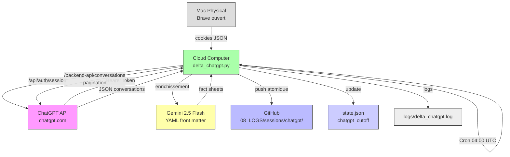

# Module B — ChatGPT Pipeline
> Y-OS Module Standard — 8 couches | v1.0 | 2026-08-03

## 1. Architecture

**Description** : Extraction delta automatique des conversations ChatGPT → fact sheets enrichies → GitHub. Maintient un ledger historique complet et consultable de toutes les interactions ChatGPT.

**Rôle** : Capitalisation des connaissances générées par ChatGPT. Traçabilité complète. Enrichissement Gemini 2.5 Flash (YAML front matter + résumé).

**Nœuds d'exécution** :
- **Cloud Computer** : exécution du cron 04:00 UTC, génération fact sheets, push GitHub
- **Mac Physical** : source des cookies Brave (session ChatGPT active, Keychain)

**Flux** :
```
Brave Mac (session active) → cookies JSON → CC
  → /api/auth/session → Bearer token
    → /backend-api/conversations (pagination) → JSON brut
      → Gemini enrichissement → YAML fact sheets
        → GitHub push atomique
```

## 2. Exécution/Code-Interface

| Mode | Déclencheur | Script |
|---|---|---|
| Auto cron | 04:00 UTC quotidien | `delta_chatgpt.py` |
| Manuel | `python3 delta_chatgpt.py` sur CC | idem |
| Refresh cookies | Manuel Mac → CC | `ingest_chatgpt_cookies.py` |

**Localisation scripts** : `/home/ubuntu/yos/ledger/` (CC)

**Points critiques** :
- ❌ Export natif ChatGPT Business désactivé — NE JAMAIS PROPOSER
- ⚠️ Browser = Brave (pas Chrome) — DB : `~/Library/Application Support/BraveSoftware/Brave-Browser/Default/Cookies`
- ⚠️ Keychain accessible uniquement via Terminal GUI (osascript), pas SSH headless
- ⚠️ Timestamps API = ISO 8601 (pas Unix float)
- ✅ Paginer avec offset jusqu'à `items` vide

## 3. Interfaces avec autres modules/systèmes

- **ERT** : accès ChatGPT = CDP niveau 2 (Cloudflare) → Mac Physical requis
- **yos-notif / MacLock** : `MacLock.acquire("ChatGPT extraction")` au démarrage
- **Gemini API** : enrichissement YAML (clé `.gemini_key` sur CC)
- **GitHub** : push atomique vers `08_LOGS/session-ledger/sessions/chatgpt/`

## 4. Référentiels/Ledger/Registry/Data sources

| Fichier | Localisation | Contenu |
|---|---|---|
| `state.json` | `/home/ubuntu/yos/ledger/` | `chatgpt_cutoff` (ISO 8601) |
| `chatgpt_cookies_fresh.json` | `/home/ubuntu/yos/ledger/` | Cookies Brave (TTL ~8h) |
| `.github_pat` | `/home/ubuntu/yos/ledger/` | Token GitHub push |
| `.gemini_key` | `/home/ubuntu/yos/ledger/` | Clé API Gemini |

**⚠️ Dette technique** : `chatgpt_cookies_fresh.json` expire en ~8h. Le cron doit idéalement re-extraire les cookies via CDP au moment de l'exécution (pas dépendre d'un fichier stale).

## 5. Maintenance/Hygiène

- **Rotation cookies** : si cron échoue 401 → re-extraire cookies via Mac (CDP ou Terminal GUI)
- **Rotation PAT GitHub** : si push échoue → régénérer via `gh auth token` sandbox → écrire `.github_pat`
- **Vérification état** : `cat /home/ubuntu/yos/ledger/state.json` → vérifier `chatgpt_cutoff`
- **Nettoyage logs** : rotation mensuelle `logs/delta_chatgpt.log`

## 6. Log & Reporting auto

- **Log** : `/home/ubuntu/yos/ledger/logs/delta_chatgpt.log`
- **Format** : `[YYYY-MM-DD HH:MM:SS] [INFO/ERROR] message`
- **Fréquence** : entrée par run cron
- **Output GitHub** : `08_LOGS/session-ledger/sessions/chatgpt/YYYY-MM-DD_<title>.md`
- **Notification Telegram** : via `@yos_notif_bot` en cas d'échec (à implémenter)

## 7. Documentation

- **Ce fichier** : `00_META/modules/MODULE-CHATGPT-PIPELINE.md`
- **AGENTS.md** : section "ChatGPT API depuis CC — PIPELINE VALIDÉ"
- **ERT** : `00_META/ERT.md` — règle CDP pour ChatGPT

## 8. Diagramme


