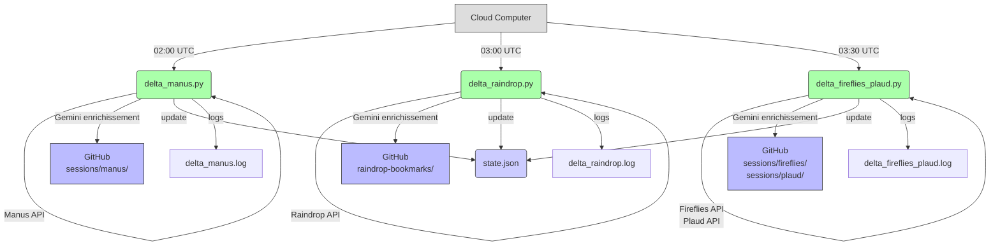

# Module C — Delta Crons (Manus + Raindrop + Fireflies/Plaud)
> Y-OS Module Standard — 8 couches | v1.0 | 2026-08-03

## 1. Architecture

**Description** : Orchestrateur d'extraction delta multi-sources. Collecte incrémentale et automatique des données depuis Manus, Raindrop, Fireflies et Plaud → fact sheets enrichies → GitHub.

**Rôle** : Enrichir le Knowledge Graph Y-OS avec toutes les interactions et bookmarks. Zéro perte d'information. Traçabilité complète.

**Nœuds d'exécution** : Cloud Computer exclusivement (crons pm2/crontab).

## 2. Exécution/Code-Interface

| Source | Cron UTC | Script | Output GitHub |
|---|---|---|---|
| Manus sessions | `0 2 * * *` | `delta_manus.py` | `08_LOGS/sessions/manus/` |
| Raindrop bookmarks | `0 3 * * *` | `delta_raindrop.py` | `08_LOGS/raindrop-bookmarks/` |
| Fireflies + Plaud | `30 3 * * *` | `delta_fireflies_plaud.py` | `08_LOGS/sessions/fireflies/` + `plaud/` |

**Logique universelle (tous scripts)** :
1. Lire `state.json` → `<source>_cutoff`
2. Appeler API source avec pagination jusqu'à `created_at <= cutoff`
3. Filtrer non-pertinents (subtasks parallèles, etc.)
4. Générer fact sheets enrichies via Gemini 2.5 Flash (YAML + résumé)
5. Redacter secrets automatiquement
6. Push GitHub atomique
7. Mettre à jour `<source>_cutoff`

**Localisation scripts** : `/home/ubuntu/yos/ledger/` (CC)

## 3. Interfaces avec autres modules/systèmes

- **ERT** : accès APIs = niveau 1 (API directe) — pas de Cloudflare sur ces sources
- **yos-notif** : notification Telegram en cas d'échec (à implémenter)
- **Gemini API** : enrichissement YAML (clé `.gemini_key`)
- **GitHub** : push atomique par source
- **Manus API** : clé `.manus_key`
- **Raindrop API** : token dans `state.json` ou variable env
- **Fireflies API** : clé API dans secrets CC
- **Plaud API** : clé API dans secrets CC

## 4. Référentiels/Ledger/Registry/Data sources

| Fichier | Localisation | Contenu |
|---|---|---|
| `state.json` | `/home/ubuntu/yos/ledger/` | Tous les cutoffs par source |
| `.manus_key` | `/home/ubuntu/yos/ledger/` | Clé API Manus |
| `.gemini_key` | `/home/ubuntu/yos/ledger/` | Clé API Gemini |
| `.github_pat` | `/home/ubuntu/yos/ledger/` | Token GitHub push |

**Structure `state.json`** :
```json
{
  "manus_cutoff": "2026-08-03T02:00:00Z",
  "last_cutoff": "2026-08-03T03:00:00Z",
  "fireflies_cutoff": "2026-08-03T03:30:00Z",
  "plaud_cutoff": "2026-08-03T03:30:00Z",
  "chatgpt_cutoff": "2026-08-03T04:00:00Z"
}
```

## 5. Maintenance/Hygiène

- **Surveillance crons** : `crontab -l` sur CC — vérifier que les 4 entrées sont actives
- **Rotation PAT GitHub** : si push échoue → régénérer `.github_pat`
- **Reset cutoff** : si re-extraction complète nécessaire → modifier `state.json` manuellement
- **Rotation logs** : mensuelle — `logs/delta_*.log`
- **Vérification santé** : `/health` via `@yos_notif_bot` Telegram

## 6. Log & Reporting auto

- **Logs** : `/home/ubuntu/yos/ledger/logs/delta_<source>.log`
- **Format** : `[YYYY-MM-DD HH:MM:SS] [INFO/ERROR] N items processed`
- **Fréquence** : entrée par run cron
- **Output GitHub** : fact sheets dans `08_LOGS/session-ledger/sessions/<source>/`
- **Notification** : Telegram `@yos_notif_bot` en cas d'échec (à implémenter)

## 7. Documentation

- **Ce fichier** : `00_META/modules/MODULE-DELTA-CRONS.md`
- **Doc complète** : `05_AUTOMATION/scheduled-updates/YOS-SCHEDULED-UPDATES.md`
- **AGENTS.md** : section "Y-OS Scheduled Updates — Cron Pipelines ACTIFS"

## 8. Diagramme


