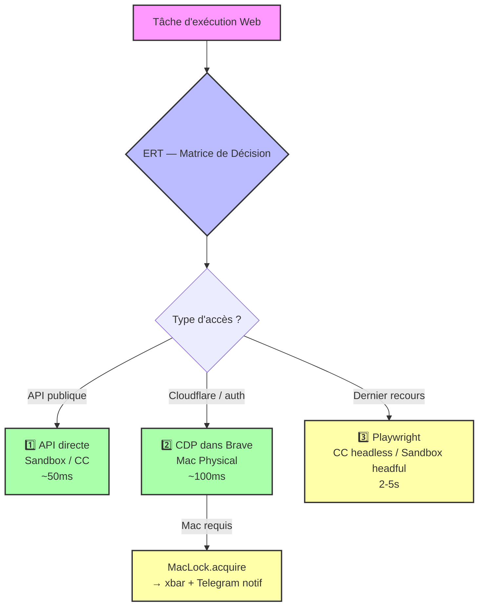

# Module A — ERT (Execution Routing Table)
> Y-OS Module Standard — 8 couches | v1.0 | 2026-08-03

## 1. Architecture

**Description** : Matrice de décision fondamentale pour le routage des tâches d'exécution web, orchestrant le flux entre différentes plateformes d'exécution. Elle assure une distribution intelligente des requêtes (API, CDP, Playwright) vers le nœud le plus approprié.

**Rôle** : Optimiser et fiabiliser l'exécution des tâches web en sélectionnant dynamiquement la ressource de calcul adéquate. Zéro improvisation — pattern → action.

**Hiérarchie canonique (3 niveaux) :**

| Priorité | Méthode | Vitesse | Quand |
|---|---|---|---|
| 1️⃣ API directe | requests/httpx | ~50ms | API publique disponible |
| 2️⃣ CDP dans vrai browser | WebSocket → `fetch()` | ~100ms | Cloudflare, auth complexe, cookies httpOnly |
| 3️⃣ Playwright non-headless | Clics UI | ~2-5s | Dernier recours |

**Nœuds d'exécution** :
- **Sandbox Manus** : orchestration, génération, Playwright UI (SPA/WebSocket)
- **Cloud Computer** : scripts Python, batches, Playwright headless
- **Mac Physical** : CDP (Keychain, cookies httpOnly, Cloudflare bypass)
- **N100** : services 24/7, Docker, automatisations lourdes

## 2. Exécution/Code-Interface

**Auto-trigger (Kernel)** : L'ERT est consultée automatiquement à chaque tâche d'exécution web via l'AUTO-TRIGGER câblé dans `yos-bootstrap`.

**Déclenchement** :
- Auto via Kernel : pattern "accès web programmatique" → consulter ERT
- Manuel via skill : `yos-bootstrap` → section Routing Dispatch
- On-request : Manus consulte `00_META/ERT.md` avant toute exécution web

**Règle d'or** : Vérifier l'ERT avant d'agir. Ne jamais improviser.

## 3. Interfaces avec autres modules/systèmes

- **yos-bootstrap (Kernel)** : AUTO-TRIGGER "exécution requise" → ERT
- **yos-notif** : si Mac requis → `MacLock.acquire()` → notification Telegram
- **ChatGPT Pipeline** : utilise CDP (niveau 2) pour accès Brave/Cloudflare
- **Delta Crons** : utilisent API directe (niveau 1) pour Manus/Raindrop/Fireflies

## 4. Référentiels/Ledger/Registry/Data sources

- **Fichier principal** : `00_META/ERT.md` (GitHub `yj000018/YOS`)
- **Copie CC** : `/home/ubuntu/yos/ERT.md`
- **Référencé dans** : `AGENTS.md` (Règle Canon #3)
- **Secrets** : aucun (document statique)

## 5. Maintenance/Hygiène

**Triggers de mise à jour** :
1. Nouveau nœud d'exécution découvert
2. Nouveau workaround validé (ex: CDP Brave 151+)
3. Changement de plateforme (ex: migration CC)
4. Contradiction avec une Lesson Learned

**Workflow** :
1. Identifier le changement
2. Mettre à jour `00_META/ERT.md`
3. Mettre à jour `AGENTS.md` si Règle Canon impactée
4. Commit GitHub avec tag `[ERT-UPDATE]`

## 6. Log & Reporting auto

Aucun log spécifique — l'ERT est un document statique. Les décisions de routage sont implicitement tracées dans les logs des modules qui l'utilisent.

## 7. Documentation

- **Fichier principal** : `00_META/ERT.md` — matrice complète + protocole
- **Référence Kernel** : `02_AGENTS/skills/yos-bootstrap/SKILL.md` — AUTO-TRIGGER
- **AGENTS.md** : Règle Canon #3

## 8. Diagramme

