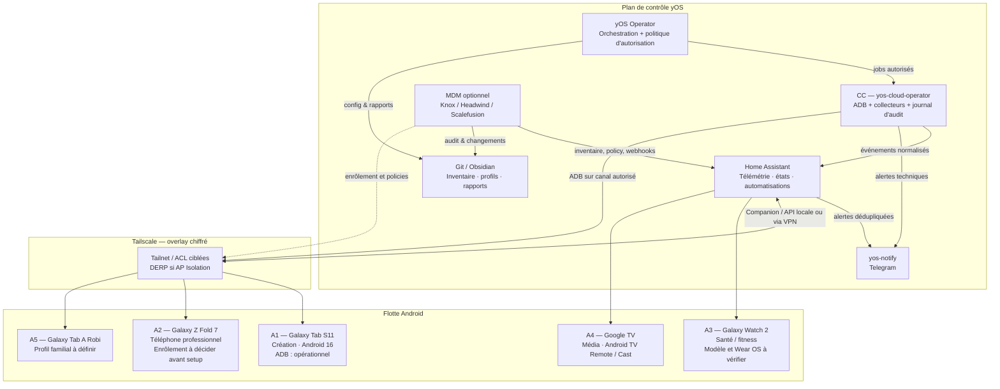

# Blueprint Architecture — yOS Android Operator

> **Statut :** architecture cible, prête à être implémentée par étapes.  
> **Périmètre :** A1 Tab S11, A2 Fold 7, A3 Galaxy Watch 2, A4 Google TV et A5 Tab A Robi.  
> **Principe directeur :** automatiser tout ce qui est **réversible, observable et traçable** ; conserver une validation humaine explicite pour tout changement destructif, sécuritaire ou irréversible.

## 0. Décision d’architecture

La flotte ne doit pas être pilotée par un MDM unique dès maintenant. Le bon ordre est un **noyau opérationnel léger**, déjà compatible avec A1, puis une couche d’enrôlement Android Enterprise ajoutée uniquement aux appareils qui seront provisionnés pour cela. Le noyau est constitué du CC, de Tailscale, d’ADB pour les terminaux explicitement autorisés, de Home Assistant pour la télémétrie et les actions contextuelles, et de Telegram comme canal d’alerte. Il donne déjà une forte automatisation sans réinitialiser la Tab S11.

L’extension MDM est **conditionnelle**. Knox Manage + Knox Service Plugin est l’option native à privilégier pour les futurs Samsung ; Headwind MDM est le POC auto-hébergé ; Scalefusion est l’alternative SaaS la plus complète pour une exploitation API/webhook. AirDroid Business reste une option de support visuel, pas le plan de contrôle, tant que ses capacités API précises n’ont pas été validées sur contrat et tenant réels. Knox Manage expose effectivement une API REST OAuth et des commandes sur les appareils gérés ; le Knox Service Plugin applique les politiques Samsung avancées via OEMConfig. [5] [6]

| Plan | Rôle | État / décision |
|---|---|---|
| **P0 — Existant** | CC → Tailscale → ADB Tab S11, cron de reconnexion, `yos-notify` | **Conserver et durcir** ; aucune réinitialisation de A1. |
| **P1 — Observabilité** | Collecteurs ADB, Home Assistant Companion, journal normalisé, Telegram | **Construire en premier** ; 80 % de la valeur opérationnelle. |
| **P2 — Gouvernance** | Inventaire, profils machine, autorisations d’action, rapports | **Construire avant MDM** ; source de vérité versionnée dans Git. |
| **P3 — MDM sélectif** | Knox / Headwind / Scalefusion, seulement sur appareils réinitialisables ou neufs | **Décision par appareil**, jamais rétroactive par défaut. |

> **Règle non négociable.** Le mode Android Enterprise *Device Owner / Fully Managed* ne peut être posé qu’au premier provisionnement ou après une réinitialisation usine. Il contrôle l’ensemble du terminal ; un *Work Profile / Profile Owner* ne contrôle que l’espace professionnel. [2] [3]

---

## 1. Architecture de référence

### 1.1 Plans, frontières et règles de sécurité

Le CC reste le seul **pont ADB permanent** de A1. L’AP Isolation Wi‑Fi rend le chemin local non fiable ; la route CC → Tailscale/DERP → Tab S11 est donc le chemin de contrôle validé. Le cron de reconnexion existant est conservé, mais traité comme un composant de disponibilité, pas comme un mécanisme de sécurité. [1]

Chaque action doit produire un événement structuré : `timestamp`, `device_id`, `initiator`, `action_class`, `command_hash`, `result`, `rollback_possible` et `evidence_path`. Les secrets de service ne sont jamais dans les scripts, les exports ou Telegram. Le journal n’enregistre ni contenu des notifications privées, ni données de santé, ni coordonnées GPS brutes ; il enregistre un statut et, le cas échéant, un identifiant d’incident.

| Classe d’autorité | Exemples | Exécution |
|---|---|---|
| **A0 — Lecture** | Batterie, stockage, connectivité, inventaire, version, état ADB | Automatique. |
| **A1 — Réversible** | Reconnexion ADB, demande HA d’actualisation des capteurs, relance d’un collecteur | Automatique, journalisée et dédupliquée. |
| **A2 — Impact limité** | Redémarrage, lancement d’application, déplacement de profil, nettoyage ciblé | Proposition avec contexte ; approbation humaine requise. |
| **A3 — Irreversible / sensible** | Factory reset, OTA, `pm clear`, désinstallation, installation d’APK, politiques globales MDM, effacement distant | Validation humaine explicite, preuve de sauvegarde et plan de retour. |

---

## 2. Blueprint machine idéale

### 2.1 Profil universel — ce qui doit être identique partout

La configuration universelle vise la continuité de service, non l’uniformisation artificielle. Les machines ne reçoivent que les applications justifiées par leur rôle. Toute application supplémentaire doit avoir un propriétaire, une fonction et une condition de retrait documentés dans l’inventaire Git.

| Domaine | Baseline recommandée | Politique yOS |
|---|---|---|
| **Identité** | Compte personnel/professionnel clairement séparé ; verrouillage par biométrie + PIN robuste ; récupération et 2FA vérifiées. | Les comptes, clés et codes de secours ne sont jamais envoyés dans les logs ou alertes. |
| **Réseau** | Tailscale installé sur les appareils qui doivent être joignables ; MagicDNS ; ACL par appareil et par port. | N’autoriser l’ADB que du CC vers les appareils désignés ; aucun port ADB exposé à Internet. |
| **Mises à jour** | Correctifs de sécurité automatiques à télécharger ; installation OTA soumise à revue de changelog, risque et fenêtre de retour. | Aucun redémarrage OTA automatique. Test/pilotage avant généralisation. |
| **Batterie** | Adaptive Battery active ; mode économie uniquement par seuil ; charge optimisée active quand disponible. | Exempter de l’optimisation batterie uniquement Tailscale, Home Assistant ou l’agent MDM si un test montre qu’Android les tue en arrière-plan. |
| **Confidentialité** | Privacy Dashboard, permissions minimales, accès localisation/capteurs explicitement activés par besoin. | Pour Home Assistant, activer les capteurs un à un ; localisation en « zone seulement » par défaut. [15] |
| **Sauvegarde** | Sauvegarde chiffrée vérifiée et inventaire des données non sauvegardées. | Contrôle mensuel de succès ; aucune purge avant une sauvegarde attestée. |
| **Inventaire** | Identifiant stable `AND-xxx`, modèle, OS, patch, owner, rôle, niveau de gestion, dernière preuve de vie. | Diff quotidien des paquets, version et posture de sécurité ; rapport hebdomadaire. |
| **Applications cœur** | Tailscale ; Home Assistant Companion si télémétrie/action utile ; navigateur sécurisé ; gestionnaire de mots de passe ; outil de notes/fichiers approuvé. | Installer seulement par Play Store ou canal MDM signé ; les APK sont interdits par défaut. |

### 2.2 Launcher et notifications

> **Recommandation : ne pas imposer un launcher tiers à toute la flotte.** One UI Home est la baseline sur Tab S11 et Fold 7 : meilleur compromis entre stabilité, DeX, mises à jour Samsung et réversibilité. Le mode kiosque / launcher dédié est réservé aux appareils monofonction.

| Profil | Launcher recommandé | Logique de notifications |
|---|---|---|
| **A1 — Tab S11 créative** | One UI Home ; dock réduit aux outils de création, fichiers, notes, calendrier et communication. DeX conservé. | Canaux critiques : sécurité, calendrier, tâches, messages prioritaires, batterie/MDM. Suggestions, marketing et réseaux sociaux en silencieux ou désactivés. |
| **A2 — Fold 7 professionnel** | One UI Home ; écran externe pour triage, écran interne pour travail. Work Profile visible par badge si WP‑C/COPE. | Canaux critiques limités aux communications et sécurité professionnelles ; pas de duplication de notifications personnelles dans l’espace pro. |
| **A3 — Watch** | Interface Wear OS d’origine ; Tiles santé, activité, calendrier et présence yOS selon compatibilité. | Seulement sécurité, urgence, navigation et activité ; zéro flux promotionnel ou digest bruyant. |
| **A4 — Google TV** | Launcher constructeur, sans remplacement. Dashboard HA en raccourci, pas comme écran par défaut. | Alertes TV seulement pour événements domestiques explicites et maintenance ; pas d’alertes système répétitives. |
| **A5 — Tab A Robi** | One UI Home avec profil familial ou launcher kiosque seulement si l’usage devient monofonction. | Liste blanche de canaux et plages horaires ; aucune notification d’administration visible à l’enfant. |

Le Companion Home Assistant peut devenir launcher par défaut pour un panneau mural dédié, mais cela ne convient ni à une tablette créative, ni à un Fold professionnel. L’application expose aussi des commandes contextuelles Android — lancement d’app, luminosité, DND, volume, actualisation des capteurs — mais elles dépendent des autorisations et de la version Android ; elles ne remplacent pas un MDM. [14]

### 2.3 Paramètres système critiques

| Domaine | A1 — Tab S11 | A2 — Fold 7 | A3 — Watch | A4 — TV | A5 — Tab A Robi |
|---|---|---|---|---|---|
| **Options développeur** | ADB maintenu uniquement pour le canal CC existant ; journaliser les hôtes autorisés ; désactiver USB debug hors besoin physique. | Désactivées par défaut ; activation ponctuelle et tracée. | Non applicable sans diagnostic constructeur. | Désactivées, sauf diagnostic ponctuel. | Désactivées. |
| **Wireless debugging** | Conserver seulement si requis par le pipeline actuel ; révoquer les autorisations au moindre doute. | Jamais permanent par défaut. | N/A. | N/A. | Désactivé. |
| **Écran** | Adaptive 120 Hz ; ne pas forcer 60 Hz ; profil couleur naturel si création. | Adaptive 120 Hz ; écran externe sobre ; délai court mais compatible avec le flux pro. | Valeurs système ; mode always-on selon autonomie réelle. | CEC, mise en veille et économie énergie cohérentes avec usage média. | Adaptive si disponible ; limite de temps d’écran selon profil familial. |
| **Batterie** | Protection batterie, charge optimisée, seuil d’alerte bas 20 %. | Idem ; contrôler température et santé si exposées. | Recharge quotidienne ; alerte de batterie basse seulement. | Veille réseau validée pour l’intégration HA. | Protection batterie et règle de charge nocturne. |
| **Privacy Dashboard** | Révision mensuelle des permissions micro/caméra/localisation. | Révision renforcée : téléphone pro, permissions par profil. | Données santé opt-in ; aucune exportation automatique. | Micro/caméra selon matériel ; supprimer services inutiles. | Révision parentale mensuelle. |
| **Mises à jour** | Télécharger automatiquement ; revue yOS avant installation majeure. | Même règle ; établir la politique avant le premier setup. | Installer après validation compatibilité téléphone/app. | Fenêtre de maintenance média. | Installer après test sur A1/A2 lorsque pertinent. |

### 2.4 Spécificités fonctionnelles par machine

| Machine | Rôle et posture | Gestion recommandée | Télémétrie prioritaire | Ce qui est explicitement hors périmètre automatique |
|---|---|---|---|---|
| **A1 — Tab S11** | Poste créatif et démonstrateur yOS ; Android 16, ADB fonctionnel via CC. | **P0/P1** : ADB + Tailscale + HA Companion. Ne pas rétro-enrôler en MDM sans accepter une réinitialisation. | ADB, Tailscale, batterie, température si lisible, stockage, version, paquets, journaux d’erreur agrégés. | Reset, APK, suppression d’app, policy MDM, OTA. |
| **A2 — Fold 7** | Téléphone professionnel, usage mixte probable. | Décider avant setup : **WP‑C/COPE** recommandé si espace personnel ; Fully Managed seulement s’il devient exclusivement professionnel. Android Enterprise prévoit précisément cette séparation. [2] [3] | Batterie, réseau, app pro, conformité patch, statut Work Profile, Tailscale et HA. | Toute politique empiétant sur l’espace personnel sans consentement explicite. |
| **A3 — Galaxy Watch 2** | Santé, fitness, micro-interactions. | Installer HA Companion/Wear seulement après vérification modèle, Wear OS, app compagnon et permissions santé. | Batterie, connexion téléphone, activité/Health Connect strictement opt‑in. | Monitoring de santé exhaustif, export cloud ou automatisation de décisions de santé. |
| **A4 — Google TV** | Media center et surface d’interaction domestique. | Home Assistant Android TV Remote + Google Cast si matériel compatible ; ADB seulement pour maintenance exceptionnelle. | Disponibilité, alimentation, volume, application active, éventuels échecs de contrôle. | Installation inconnue, commandes de compte, changements réseau sans validation. |
| **A5 — Tab A Robi** | Terminal familial, rôle à confirmer. | Profil parental / Work Profile selon ownership ; MDM seulement si l’appareil est réinitialisable et son rôle défini. | Batterie, localisation « zone seulement » si consentie, temps d’écran, paquets approuvés. | Surveillance du contenu, collecte de notifications, suppression automatique d’apps. |

---

## 3. Matrice des capacités d’administration

| Outil / couche | Portée d’administration | API / intégration exploitable | Précondition | Valeur pour yOS | Limite décisive | Position cible |
|---|---|---|---|---|---|---|
| **ADB via Tailscale** | Contrôle technique d’un terminal explicitement autorisé : `dumpsys`, `df`, `pm`, screenshots, fichiers, UI, logs, reboot. | Shell, scripts CC, journal d’audit ; aucune API métier native. | Pairing initial ; canal ADB actif ; ACL Tailscale ; appareil allumé/connecté. | Le meilleur levier immédiat pour A1, diagnostics et automatisation fine. | Ne remplace pas une policy ; stabilité dépend de l’état debug ; risque élevé si accès trop large. | **Noyau P0** pour appareils consentis. |
| **Samsung Knox Manage** | Inventaire, groupes, audit, installation/désinstallation, localisation, lock, reboot, reset, notifications et commandes de terminal géré. | REST API OAuth 2.0, clients API administrés. [5] | Tenant/licence Knox, appareil enrôlé, profil compatible. | Plan de contrôle Samsung industrialisable et audit-able. | Non rétroactif sans enrôlement ; effet des commandes dépend du mode et de la policy. | **Préféré P3** pour futurs Samsung. |
| **Knox Mobile Enrollment** | Création, affectation et suppression de profils d’enrôlement Samsung. | REST API régionale ; profils et appareils. [7] | Appareil admissible / canal revendeur / tenant Knox. | Onboarding reproductible du Fold et des futurs Samsung. | Utilité faible pour A1 déjà provisionnée ; dépend du statut d’achat. | **À préparer avant A2**. |
| **Knox Service Plugin** | Politiques Samsung avancées : restrictions, réseau, DeX, quick panel, périphériques, VPN et paramètres. | OEMConfig + feedback channel via MDM. [6] | MDM compatible, KSP, licences selon features, DO/PO/COMP. | Différenciation Samsung à forte valeur. | Pas un outil autonome ; nécessitera une vraie stratégie MDM. | **Extension Knox**. |
| **Home Assistant Companion** | Télémétrie et actions consensuelles : batterie, charge, réseau, capteurs, stockage, localisation, commandes de notification. | Entités HA, services `notify.mobile_app`, automatisations ; données locales contrôlées. [13] [14] | App installée, serveur accessible, permissions et exclusions batterie testées. | Observabilité unifiée, contexte domotique, notifications intelligentes. | Pas de Device Owner ; capteurs et commandes limités par permission/OS. | **Noyau P1**. |
| **Home Assistant Android TV Remote** | Navigation, volume, touches, application active et lancement d’apps/links Android TV. | `remote`, `media_player`, Google Cast complémentaire. [16] | Android TV Remote Service, modèle compatible, pairing HA. | Plan média simple et local. | Pas Fire TV ; limitations firmware et certaines apps, notamment Netflix. | **P1 pour A4**. |
| **Headwind MDM** | DPC, QR enrollment, gestion d’apps, groupes, kiosque, configurations, status et logs. | REST API JWT ; API agent ; auto-hébergeable. [8] [9] | Serveur, Device Owner/QR, terminal réinitialisable ; POC sécurité. | Alternative souveraine, intégrable à n8n/CC. | Coût d’exploitation ; provisioning et contraintes Play Protect à tester. | **POC P3** sur appareil test. |
| **Scalefusion** | Inventaire, batterie, localisation, profils, groupes, lock/reboot, messages, conformité et remote management selon édition. | Developer API, webhooks et SDK ; 30 req/min documentées. [10] [11] | Tenant, droits API, terminal géré, profil et groupe. | SaaS le plus mature pour 90 % d’administration standard. | Dépendance SaaS, coût, quotas et enrôlement Android Enterprise. | **Alternative P3** si vitesse > souveraineté. |
| **AirDroid Business** | Support distant web, gestion de flotte et intégrations annoncées. | API et liens de contrôle présentés publiquement. [12] | Tenant, agent Business et droits de contrôle. | Support visuel ponctuel. | Détail d’API et granularité de policy non validés dans la documentation publique consultée. | **Backup**, pas plan de contrôle. |

### 3.1 Choix MDM par appareil

| Appareil | Choix de gestion | Raison | Point de décision |
|---|---|---|---|
| **A1 Tab S11** | ADB + HA, sans MDM maintenant. | Conserve la configuration actuelle sans reset. | MDM possible seulement après backup validé + acceptation d’un reset. |
| **A2 Fold 7** | Knox Manage/KSP + **WP‑C/COPE** si usage pro/personnel ; Fully Managed si pro exclusif. | Le terminal arrive neuf : fenêtre d’enrôlement idéale. | Décider ownership et niveau de confidentialité **avant première configuration**. |
| **A3 Watch** | HA Companion/Wear d’abord. | Le modèle et la pile Wear OS doivent être confirmés. | N’engager aucun MDM Wear sans compatibilité documentée. |
| **A4 Google TV** | HA Android TV Remote + Cast. | Usage média ; besoin de contrôle, pas d’EMM. | Vérifier service Android TV Remote et modèle. |
| **A5 Tab A Robi** | Profil familial ; Headwind/Knox uniquement si appareil dédié et réinitialisable. | Les politiques doivent protéger l’enfant sans surveillance intrusive. | Clarifier ownership, âge et rôle avant setup. |

---

## 4. Monitoring et sysadmin automatisé

### 4.1 Contrat de télémétrie

La télémétrie doit servir l’action, pas produire du bruit. Les collecteurs partent toutes les cinq minutes pour la disponibilité, toutes les quinze à trente minutes pour la santé, et quotidiennement pour l’inventaire. Home Assistant met à jour ses capteurs Android à un intervalle normal de quinze minutes ou plus rapidement selon le réglage ; le mode rapide permanent augmente la charge batterie. [13]

| Domaine | Signal primaire | Seuil / règle | Action automatique | Escalade |
|---|---|---|---|---|
| **Connectivité** | Ping Tailscale, état `adb devices`, dernier check-in HA/MDM | 3 échecs consécutifs ; distinguer ADB, tailnet et appareil hors ligne. | Tenter reconnexion ADB selon le cron existant. | Telegram P1 après corrélation ; ne pas spammer. |
| **Batterie** | `dumpsys battery` ou capteur HA | <20 % non chargé ; <10 % critique ; température anormale seulement si capteur fiable. | Collecte accélérée, pas de commande invasive. | Telegram P2/P1 selon criticité et rôle. |
| **Stockage** | `df /data`, capteur HA Storage | <15 % libre : avertissement ; <8 % : critique. | Rapport de candidats nettoyables, sans suppression. | Telegram P2 + action suggérée. |
| **RAM / performance** | `dumpsys meminfo`, uptime, capteurs app | Détection de tendance, pas d’alerte sur un échantillon isolé. | Relancer le collecteur ; attacher diagnostic compact. | P3 dans rapport, P2 si boucle de crash. |
| **Apps / crash** | Inventaire packages, logcat filtré, MDM/HA si exposé | Nouveau package non approuvé, crash répété, version dérivante. | Capturer preuve et diff. | P2 pour app critique ; P3 sinon. |
| **ADB / debug** | État device, port attendu et journal de reconnect | Appareil `unauthorized`, `offline` ou disparition répétée. | Reconnexion technique. | P1 si indisponibilité prolongée ; pairing non automatique. |
| **Tailscale** | Reachability depuis CC, dernier état connu | Endpoint non joignable >10 min et ADB/HA indisponibles. | Aucun bypass de réseau. | P1 avec diagnostic de couche. |
| **Conformité** | Patch, OS, versions app, permission critique | Derive par rapport au profil machine. | Rapport de drift. | P3 ; correction en A2/A3 uniquement. |

### 4.2 Politique Telegram via `yos-notify`

| Niveau | Déclencheurs | Message attendu | Anti-bruit |
|---|---|---|---|
| **P1 — Action rapide** | ADB et Tailscale indisponibles après 3 cycles ; appareil professionnel perdu ; batterie <10 % hors charge sur appareil critique. | `AND-001 / indisponible / couche : Tailscale+ADB / depuis 12 min / next: vérifier Tailscale locale`. | Un seul incident actif par appareil + résolution explicite. |
| **P2 — Attention** | Batterie <20 %, stockage <15 %, crash répété, app ou posture non conforme. | `AND-001 / stockage 12 % / 4,8 GB libres / nettoyage conseillé`. | Cooldown de 6 h ; seuil de sortie pour clôturer. |
| **P3 — Digest** | Mise à jour disponible, nouvelle app, dérive mineure, entretien mensuel. | Synthèse dans le rapport hebdomadaire. | Aucun push immédiat. |
| **P4 — Audit** | Succès de reconnect, changement inventaire normal, capteur restauré. | Journal uniquement. | Pas de Telegram, sauf passage P1→OK. |

Les messages Telegram doivent contenir l’état, la couche fautive et la prochaine action ; jamais le contenu d’une notification, une position GPS ou une donnée de santé. L’alerte de récupération est obligatoire afin de fermer les incidents sans nécessiter une vérification manuelle.

### 4.3 Rapport hebdomadaire

Le rapport est un fichier Markdown versionné dans Git, généré le lundi matin et concis : un tableau d’état de flotte, les deltas d’inventaire, les mises à jour disponibles, les anomalies ouvertes/fermées et les trois actions à valeur maximale. Il doit comparer chaque appareil à son propre profil, pas à une baseline universelle qui n’aurait pas de sens pour une montre ou une TV.

| Section | Contenu | Décision produite |
|---|---|---|
| **Fleet pulse** | Reachability, dernier check-in, ADB/HA/MDM, incidents et tendance. | Identifier les machines sans preuve de vie. |
| **Santé** | Batterie, stockage, redémarrages, crashs agrégés, performance. | Prioriser entretien ou investigation. |
| **Dérives** | Packages, permissions critiques, versions OS/patch et configuration attendue. | Accepter, corriger ou documenter l’écart. |
| **Mises à jour** | Changelog OTA et versions d’apps ; niveau de risque. | Recommander pilote, report ou installation approuvée. |
| **Automatisations** | Jobs exécutés, échecs, alertes supprimées, efficacité. | Ajuster seuils et couverture. |
| **Prochain cycle** | Trois actions maximum avec owner et précondition. | Éviter les listes interminables. |

### 4.4 Cleanup mensuel : principe « hygiène, pas nettoyeur miracle »

Android n’a pas d’équivalent fiable à CleanMyMac qui soit sûr en un clic. Les apps de nettoyage génériques font souvent disparaître les caches utiles sans résoudre le problème de fond. Le job mensuel doit donc produire un **rapport de candidats**, jamais une purge automatique.

| Zone | Détection | Action autorisée | Action interdite sans validation |
|---|---|---|---|
| Téléchargements, captures et exports | Âge, taille, doublons identifiables, statut sauvegarde. | Présenter liste de candidats et libérer une copie déjà sauvegardée sur approbation. | Suppression d’originaux non vérifiés. |
| Apps non utilisées | Inventaire, propriétaire, rôle et dernière justification connue. | Proposer mise en veille, archivage Play Store ou désinstallation. | Désinstallation automatique. |
| Cache applicatif | Anomalie de stockage par app. | Proposer nettoyage depuis l’app ou paramètres. | `pm clear` : efface les données, donc A3. |
| Médias et offline | Taille, sauvegarde et droits de diffusion. | Rapport par application. | Purge de fichiers de création ou médias sous licence. |
| Sécurité | Autorisations, apps hors source approuvée, debug. | Ouvrir incident et proposer correction. | Révocation sans évaluer l’impact métier. |

---

## 5. Les 10 premières automatisations à implémenter

| # | Automatisation | Valeur | Déclencheur / fréquence | Autorité | Critère de réussite |
|---:|---|---|---|---|---|
| **1** | **Registre machine et snapshot d’inventaire** | La source de vérité des appareils, packages, OS et rôles. | Chaque nuit ; à l’ajout d’appareil. | A0 | Chaque machine a une fiche et un diff lisible. |
| **2** | **Health probe ADB/HA** | Batterie, stockage, uptime, réseau, ADB et dernière preuve de vie. | 5–30 min selon métrique. | A0 | Tableau de santé complet pour A1, puis extension par rôle. |
| **3** | **Reconnexion ADB corrélée** | Rend le cron existant intelligible : ADB vs tailnet vs appareil. | Échec de sonde ; cron 2 min existant. | A1 | Une alerte donne la cause probable, pas seulement « offline ». |
| **4** | **Machine d’état Telegram** | Évite le bruit et ferme automatiquement les incidents rétablis. | Chaque événement santé. | A1 | Une seule alerte active par incident et message de résolution. |
| **5** | **Détection de drift applicatif** | Détecte app installée/supprimée, changement critique et package inattendu. | Quotidien. | A0 | Diff avec classification approuvée / à revoir / critique. |
| **6** | **Sentinelle crash & performance** | Transforme logcat et mémoire en incidents actionnables. | Fenêtre de 15 min + agrégation quotidienne. | A0 | Aucun log brut dans Telegram ; preuves stockées avec incident. |
| **7** | **Rapport hebdomadaire yOS Android** | Vue de flotte utile en moins de cinq minutes. | Hebdomadaire. | A0 | État, dérives, updates, anomalies et trois actions prioritaires. |
| **8** | **Conseiller cleanup mensuel** | Réduit le stockage perdu sans détruire de données. | Mensuel. | A0/A2 | Liste de candidats avec volume, backup et action proposée. |
| **9** | **Analyseur OTA / changelog** | Empêche les mises à jour aveugles. | Nouvelle OTA détectée. | A0 | Note : sécurité, compatibilité, known issues, pilote recommandé ou report. |
| **10** | **Policy-drift guard** | Prépare le passage MDM et protège les futurs profils. | À chaque check-in MDM ou changement de configuration. | A0/A2 | Divergence détectée, remédiation proposée, jamais poussée aveuglément. |

### Contrat minimal des jobs

Tous les jobs doivent être **idempotents**, avoir un timeout, produire une sortie JSON/Markdown compacte et utiliser des identifiants d’appareil stables. La gestion d’erreur suit une règle simple : deux nouveaux essais immédiats si l’échec est transitoire, puis incident corrélé ; aucun job ne boucle indéfiniment. Les actions de modification passent par la classification A0–A3 ci-dessus.

---

## 6. Éducation et proactivité permanente

La proactivité ne consiste pas à envoyer des nouveautés Android au fil de l’eau. Elle consiste à détecter une opportunité lorsque le signal change la qualité, la sécurité ou la simplicité de la flotte.

| Veille | Signal | Traitement yOS | Sortie |
|---|---|---|---|
| **Usage sous-optimal** | Apps jamais ouvertes, stockage anormal, pertes de connectivité, flux notification trop dense. | Corréler sur 30 jours, éviter les conclusions à partir d’une journée. | Recommandation ponctuelle avec impact attendu et possibilité de refus. |
| **Android / One UI / Knox** | Release notes, bulletins sécurité, changements Device Owner/Work Profile. | Lire la documentation officielle, analyser l’impact par machine et classer le risque. | Note OTA P3 ; aucune installation automatique. |
| **Nouvelles capacités HA** | Nouveau capteur/action pertinent, compatibilité Wear ou TV. | Évaluer valeur, permissions et coût batterie avant activation. | POC limité à un appareil, puis extension. |
| **Risque de configuration** | Debug durable, permission sensible, port non justifié, app hors catalogue. | Contrôler contre le profil machine approuvé. | Incident P2/P3 et remédiation proposée. |

Les données santé de la montre et la localisation restent des **données de contexte volontaire**. Home Assistant peut exposer des capteurs Android et Health Connect, mais les capteurs doivent être activés explicitement et leur fréquence calibrée ; il ne faut ni inférer une condition de santé, ni déplacer ces données vers Telegram. [13] [15]

---

## 7. Roadmap de déploiement

| Horizon | Cible | Résultats attendus | Conditions de passage |
|---|---|---|---|
| **Semaine 1 — A1 Tab S11 + A3 Watch** | Stabiliser le noyau sans changer la posture de A1 ; qualifier A3 à son arrivée. | Fiches `AND-001` et `AND-003`, inventaire A1, probes ADB/HA, alertes dédupliquées, rapport de santé initial. Pour A3 : vérifier modèle, Wear OS, téléphone compagnon, disponibilité HA/Wear et permissions santé avant toute automatisation. | A1 : trois jours de métriques stables et aucune alerte bruyante. A3 : compatibilité réelle connue, pas supposée. |
| **Semaine 2 — A2 Fold 7** | Choisir et appliquer le bon modèle de gestion **avant setup**. | Matrice de décision COPE vs Fully Managed, profil application pro, Tailscale, HA, baseline notifications, test de recovery. Si Knox/EMM est retenu, enrôlement dès OOBE ; sinon, baseline légère documentée. | Décision ownership/confidentialité explicite et procédure de retour validée. |
| **Mois 1 — Flotte complète** | Étendre le noyau, puis décider le MDM par usage. | Google TV intégrée à HA Remote/Cast, profil A5 défini, rapport hebdomadaire, cleanup consultatif, sentinelle OTA, POC Headwind **ou** qualification Knox/Scalefusion, pas les trois en parallèle. | Couverture télémétrique ≥90 % des signaux définis ; zéro action A3 non auditée. |
| **Mois 2+ — Industrialisation** | Réduire le travail manuel sans accroître les droits. | Contrats de jobs, dashboard de flotte, politiques as code, banque de playbooks, tests de restauration. | Démontrer que chaque automatisation économise du temps et reste réversible. |

### Gating decision — Fold 7

| Si le Fold 7 est… | Alors choisir… | Conséquence |
|---|---|---|
| **Exclusivement professionnel** | Fully Managed / Device Owner via Knox ou EMM. | Gestion complète, mais espace personnel non prioritaire. [2] [3] |
| **Professionnel avec usage personnel assumé** | WP‑C/COPE via Knox/EMM. | Séparation claire pro/perso ; contrôle plus limité sur le perso. [2] [3] |
| **Personnel avec outils professionnels** | Work Profile/BYOD. | Respect maximal du perso ; posture de conformité plus limitée. [2] |
| **Non prêt à être enrôlé** | Tailscale + HA + inventaire, sans MDM. | Réversible, mais pas d’enforcement de policy. |

---

## 8. Ordre d’exécution recommandé

1. **Construire P1 sur A1** : inventaire, health probe, corrélation de connectivité, alerte à état et rapport initial.
2. **Qualifier A3**, sans suppositions sur le modèle, le système ou la compatibilité Health Connect/Wear.
3. **Prendre la décision Fold 7 avant l’OOBE**, car l’enrôlement Device Owner se joue à cette étape.
4. **Intégrer A4 via Home Assistant**, après validation du modèle et de l’Android TV Remote Service ; compléter avec Cast si le besoin de métadonnées média existe. [16]
5. **Décider P3 sur preuve** : un seul POC MDM sur un appareil réinitialisable, critères de succès mesurables, puis seulement adoption.

La recommandation structurante est donc : **ne pas transformer A1 en laboratoire MDM**. A1 doit devenir l’exemple d’un noyau yOS Android observable et sûr ; A2, livré neuf, constitue le point naturel pour valider le modèle d’enrôlement Samsung. Cela réduit les risques, garde la flotte utilisable et prépare une automatisation réelle sans confusion entre télécommande ADB, domotique HA et gouvernance MDM.

---

## Références

[1]: https://raw.githubusercontent.com/yj000018/YOS/main/04_INTERFACES/android/YOS-ANDROID-OPERATOR.md "Référentiel yOS Android Operator"
[2]: https://source.android.com/docs/devices/admin "Android — Device management overview"
[3]: https://developers.google.com/android/management/provision-device "Google — Enroll and provision a device"
[4]: https://developer.android.com/work/dpc/device-management "Android — Device control"
[5]: https://docs.samsungknox.com/dev/knox-manage/api/ "Samsung Knox Manage REST API"
[6]: https://docs.samsungknox.com/dev/managed-configurations/knox-service-plugin/ "Samsung Knox Service Plugin / OEMConfig"
[7]: https://docs.samsungknox.com/dev/knox-mobile-enrollment/server-integration/api/ "Samsung Knox Mobile Enrollment API"
[8]: https://h-mdm.com/open-source/ "Headwind MDM Open Source"
[9]: https://qa.h-mdm.com/4625/is-there-any-rest-api "Headwind MDM REST API"
[10]: https://help.scalefusion.com/docs/scalefusion-developer-api "Scalefusion Developer API"
[11]: https://scalefusion.com/api-and-webhooks/ "Scalefusion APIs and webhooks"
[12]: https://www.airdroid.com/wiki/web-based-remote-access/ "AirDroid Business — Web remote access and API integration"
[13]: https://companion.home-assistant.io/docs/core/sensors/ "Home Assistant Companion — Sensors"
[14]: https://companion.home-assistant.io/docs/notifications/notification-commands/ "Home Assistant Companion — Notification commands"
[15]: https://companion.home-assistant.io/docs/core/location/ "Home Assistant Companion — Location"
[16]: https://www.home-assistant.io/integrations/androidtv_remote/ "Home Assistant — Android TV Remote"
