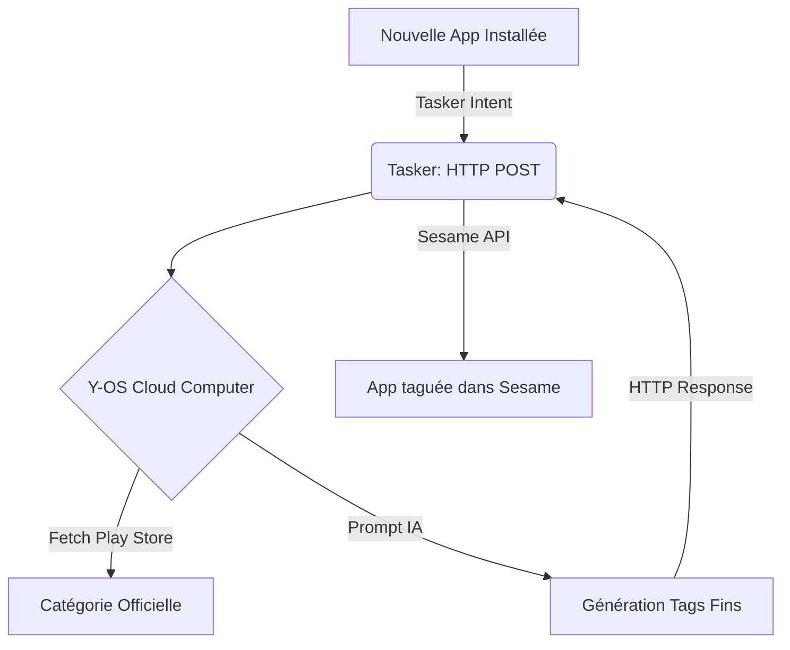

# Y-OS Android — Stratégie de Catégorisation Fine des Apps

**Document d'Architecture** — *Comment organiser, taguer et retrouver instantanément des centaines d'apps sur Android sans gestion manuelle.*

---

## 1. Le problème des dossiers (UI)

Sur Android (comme sur iOS), la gestion des dossiers dans le launcher est une tâche manuelle, fastidieuse, et statique.
- Les launchers ne permettent pas de sous-dossiers (ex: `Création/3D/Scan`).
- ADB ne peut pas créer de dossiers dynamiquement sans root.
- Une app ne peut être que dans un seul dossier à la fois.

**Conclusion :** Le paradigme des "dossiers sur l'écran d'accueil" est obsolète pour un power user avec plus de 100 apps.

---

## 2. La solution Y-OS : Search-First + Tags Dynamiques

La stratégie Y-OS repose sur l'abandon de l'organisation manuelle au profit d'un moteur de recherche universel enrichi par des tags.

### Le Moteur : Sesame (Universal Search)
Sesame est l'équivalent de Raycast sur Android.
- **Accès instantané :** Un geste (swipe down sur l'écran d'accueil Nova) ouvre Sesame.
- **Recherche fonctionnelle :** Tape "texte" → Sesame trouve tous les éditeurs de texte, même si le mot "texte" n'est pas dans le nom de l'app.
- **Intégration Tasker :** Sesame peut déclencher des tâches Tasker directement depuis la barre de recherche.

### La Catégorisation Fine (Tags vs Dossiers)
Au lieu de dossiers rigides, Y-OS utilise des **Tags**. Une app peut avoir plusieurs tags.

| App | Tags Y-OS |
|---|---|
| Polycam | `#creation`, `#3d`, `#scan` |
| Nomad Sculpt | `#creation`, `#3d`, `#modeling` |
| Concepts | `#creation`, `#2d`, `#vector` |
| Obsidian | `#ops`, `#text`, `#pkm` |

**Comment ça marche en pratique :**
1. Tu tapes `3d` dans Sesame → Polycam et Nomad Sculpt apparaissent.
2. Tu tapes `scan` dans Sesame → Polycam apparaît.
3. Tu n'as jamais eu besoin de ranger Polycam dans un sous-dossier `Création/3D/Scan`.

---

## 3. Automatisation via Tasker + API Play Store

Pour éviter de taguer manuellement chaque nouvelle app, Y-OS utilise un pipeline automatisé :

1. **Détection :** Tasker détecte l'installation d'une nouvelle app.
2. **Enrichissement :** Tasker appelle un webhook Y-OS sur le Cloud Computer.
3. **Catégorisation IA :** Le Cloud Computer interroge l'API Play Store pour récupérer la catégorie officielle de l'app (ex: `PRODUCTIVITY`), puis demande à l'IA (Claude/Gemini) de générer des tags Y-OS pertinents basés sur la description de l'app.
4. **Injection :** Le Cloud Computer renvoie les tags à Tasker, qui les injecte dans Sesame via l'intégration native Sesame/Tasker.

### Architecture du Pipeline

---

## 4. Plan d'implémentation (Next Steps)

1. **Phase 1 (Immédiate) :** Installer Sesame, le lier à Nova Launcher (Swipe Down = Sesame Search). Utiliser la recherche fonctionnelle native de Sesame.
2. **Phase 2 (Session Tasker) :** Créer le profil Tasker `OnPackageInstall` pour intercepter les nouvelles apps.
3. **Phase 3 (CC) :** Créer le webhook d'enrichissement IA sur le Cloud Computer.

*Ce document est la base de la session Tasker de l'Android Academy.*
