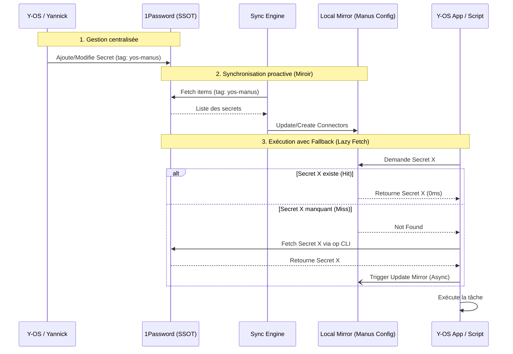

# Y-OS Secret Management Architecture

## 1. Vision et Principes

L'objectif de cette architecture est de créer un système unifié, performant et sécurisé de gestion des secrets pour l'ensemble de l'écosystème Y-OS (Manus, JGPT, n8n, etc.). 

Le système repose sur **trois principes fondamentaux** :
1. **Single Source of Truth (SSOT)** : 1Password (MAIN VAULT) est l'unique source de vérité.
2. **Local Mirroring (Haute Performance)** : Chaque sous-système (Manus, JGPT) maintient un miroir local ultra-rapide des secrets dont il a besoin.
3. **Lazy Fetch & Auto-Heal (Fallback Mechanism)** : Si un secret est manquant dans le miroir local lors de l'exécution, le système va le chercher dans 1Password, l'utilise, et met à jour le miroir local de manière asynchrone.

## 2. Structure 1Password (Tagging & Catégorisation)

Pour assurer une synchronisation propre, les items dans 1Password doivent respecter une structure stricte :
- **Catégorie** : `API Credential`
- **Tags requis** :
  - `yos-secret` : Marqueur global indiquant que ce secret appartient à l'écosystème Y-OS.
  - `yos-manus` / `yos-jgpt` / `yos-n8n` : Tags spécifiques définissant dans quels miroirs ce secret doit être propagé.
- **Champs standards** :
  - `credential` (ou `password`) : La valeur réelle du secret.
  - `username` (optionnel) : Identifiant si nécessaire.
  - `hostname` (optionnel) : URL du service.
  - `yos-env-var` (optionnel) : Nom de la variable d'environnement cible (ex: `OPENAI_API_KEY`). Si absent, déduit du titre.

## 3. Architecture des Composants

### 3.1. Le Sync Engine (Push)
Un processus planifié (cron) ou déclenché manuellement qui :
1. Lit tous les items taggés `yos-secret` depuis 1Password.
2. Identifie les systèmes cibles via les tags (ex: `yos-manus`).
3. Pousse (push) les mises à jour vers les miroirs locaux des systèmes concernés.

### 3.2. Le Miroir Local (Manus / JGPT)
Dans Manus, le miroir local est géré par les **Custom API Connectors** (via `manus-config`).
- Les secrets sont stockés de manière sécurisée et injectés comme variables d'environnement lors de l'exécution.
- La latence d'accès est de 0ms (déjà en mémoire).

### 3.3. Le Fallback Mechanism (Lazy Fetch)
Lorsqu'un script ou un outil dans Y-OS a besoin d'un secret (ex: `GITHUB_PAT`) :
1. Il vérifie l'environnement local (le miroir).
2. **Hit** : Il utilise la valeur locale (performance max).
3. **Miss** : 
   - Il déclenche un appel `op read` ou `op item get` vers 1Password.
   - Il utilise la valeur récupérée.
   - Il déclenche un événement de mise à jour asynchrone pour ajouter ce secret au miroir local.

### 3.4. L'Audit & Consistency Checker
Un script d'audit régulier qui :
1. Récupère l'état actuel du miroir (ex: tous les Custom API Connectors Manus).
2. Récupère l'état attendu depuis 1Password.
3. Compare les deux (présence, fraîcheur).
4. Génère un rapport d'incohérence et propose des actions de remédiation.

## 4. Diagramme de Flux

## 5. Prochaines Étapes d'Implémentation
1. **Refactorisation du script actuel** : Transformer le script de test en un véritable `yos_secret_sync.py` robuste, basé sur les tags 1Password.
2. **Implémentation du Checker** : Créer `yos_secret_audit.py` pour valider la cohérence.
3. **Création d'un module Fallback Python** : Une librairie `yos_secrets.py` importable par n'importe quel script pour abstraire la logique Hit/Miss/Fetch.
