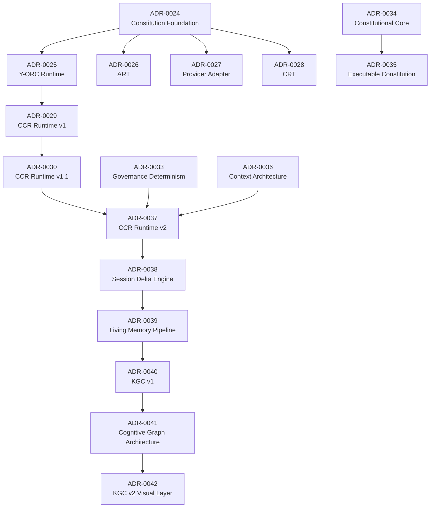

# Y-OS ADR Dependency Map — Mermaid Fallback

*See [[YOS_ADR_Dependency_Map.canvas]] for interactive Canvas version.*

```mermaid
graph TD
    ADR24["ADR-0024\nConstitution Foundation"] --> ADR25["ADR-0025\nY-ORC Runtime"]
    ADR24 --> ADR26["ADR-0026\nART"]
    ADR24 --> ADR27["ADR-0027\nProvider Adapter"]
    ADR24 --> ADR28["ADR-0028\nCRT"]
    ADR25 --> ADR29["ADR-0029\nCCR Runtime v1"]
    ADR29 --> ADR30["ADR-0030\nCCR Runtime v1.1"]
    ADR30 --> ADR37["ADR-0037\nCCR Runtime v2"]
    ADR33["ADR-0033\nGovernance Determinism"] --> ADR37
    ADR34["ADR-0034\nConstitutional Core"] --> ADR35["ADR-0035\nExecutable Constitution"]
    ADR36["ADR-0036\nContext Architecture"] --> ADR37
    ADR37 --> ADR38["ADR-0038\nSession Delta Engine"]
    ADR38 --> ADR39["ADR-0039\nLiving Memory Pipeline"]
    ADR39 --> ADR40["ADR-0040\nKGC v1"]
    ADR40 --> ADR41["ADR-0041\nCognitive Graph Architecture"]
    ADR41 --> ADR42["ADR-0042\nKGC v2 Visual Layer"]
```
