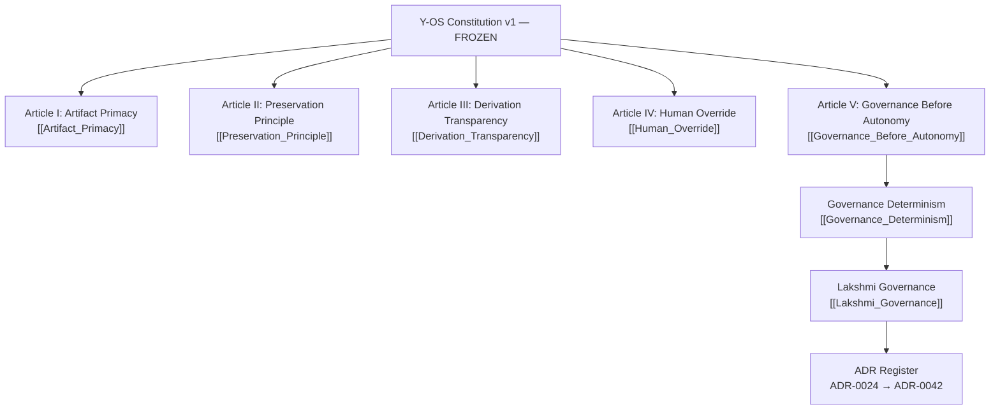

# Y-OS Constitutional Stack — Mermaid Fallback

*See [[YOS_Constitutional_Stack.canvas]] for interactive Canvas version.*

```mermaid
graph TD
    CONST["Y-OS Constitution v1 — FROZEN"]
    CONST --> A1["Article I: Artifact Primacy\n[[Artifact_Primacy]]"]
    CONST --> A2["Article II: Preservation Principle\n[[Preservation_Principle]]"]
    CONST --> A3["Article III: Derivation Transparency\n[[Derivation_Transparency]]"]
    CONST --> A4["Article IV: Human Override\n[[Human_Override]]"]
    CONST --> A5["Article V: Governance Before Autonomy\n[[Governance_Before_Autonomy]]"]
    A5 --> GD["Governance Determinism\n[[Governance_Determinism]]"]
    GD --> LG["Lakshmi Governance\n[[Lakshmi_Governance]]"]
    LG --> ADR["ADR Register\nADR-0024 → ADR-0042"]
```
