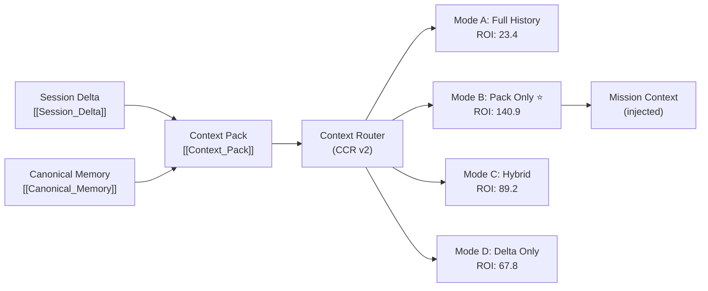

# Y-OS Context Architecture — Mermaid Fallback

*See [[YOS_Context_Architecture.canvas]] for interactive Canvas version.*

```mermaid
graph LR
    SD["Session Delta\n[[Session_Delta]]"] --> CP["Context Pack\n[[Context_Pack]]"]
    CM["Canonical Memory\n[[Canonical_Memory]]"] --> CP
    CP --> CR["Context Router\n(CCR v2)"]
    CR --> MA["Mode A: Full History\nROI: 23.4"]
    CR --> MB["Mode B: Pack Only ⭐\nROI: 140.9"]
    CR --> MC["Mode C: Hybrid\nROI: 89.2"]
    CR --> MD["Mode D: Delta Only\nROI: 67.8"]
    MB --> MI["Mission Context\n(injected)"]
```
