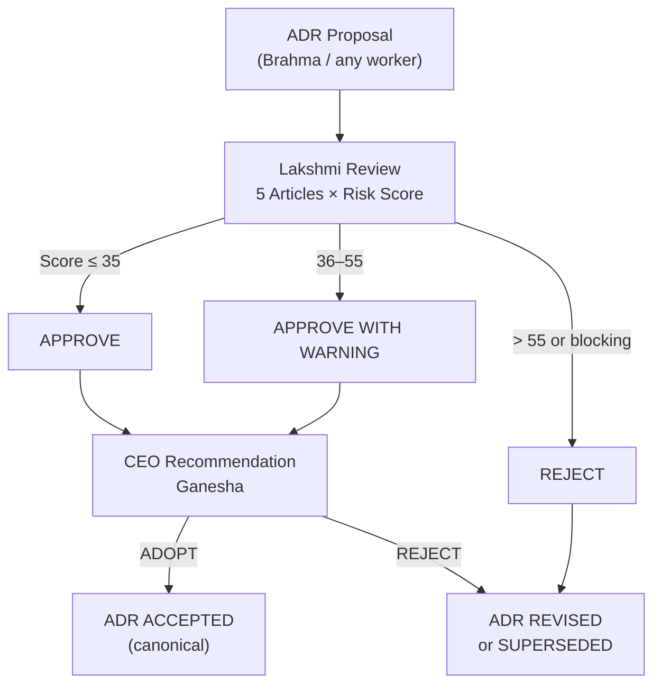

# Y-OS Governance Flow — Mermaid Fallback

*See [[YOS_Governance_Flow.canvas]] for interactive Canvas version.*

## Semantic Links

- **governed_by:** [[Y-OS_Constitution_v1]]
- **reviewed_by:** [[ADR-0044_Live_Worker_Execution_v1]], [[ADR-0045_Multi_Worker_Pipeline_Orchestration_v1]], [[ADR-0046_Organizational_Digital_Twin_Runtime_v1]], [[ADR-0047_Autonomous_Organizational_Observability]], [[ADR-0048_Roadmap_Architecture_Review]]