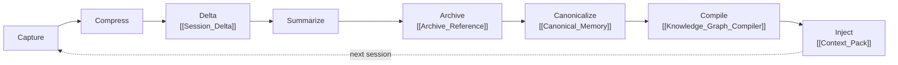

# Y-OS Living Memory Pipeline — Mermaid Fallback

*See [[YOS_Living_Memory_Pipeline.canvas]] for interactive Canvas version.*

```mermaid
graph LR
    CAP[Capture] --> COMP[Compress]
    COMP --> DELTA["Delta\n[[Session_Delta]]"]
    DELTA --> SUM[Summarize]
    SUM --> ARCH["Archive\n[[Archive_Reference]]"]
    ARCH --> CANON["Canonicalize\n[[Canonical_Memory]]"]
    CANON --> COMPILE["Compile\n[[Knowledge_Graph_Compiler]]"]
    COMPILE --> INJ["Inject\n[[Context_Pack]]"]
    INJ -.->|next session| CAP
```
