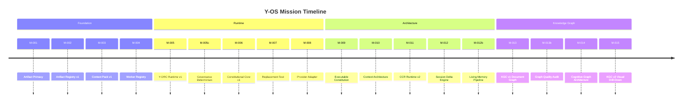

# Y-OS Mission Evolution — Mermaid Fallback

*See [[YOS_Mission_Evolution.canvas]] for interactive Canvas version.*

```mermaid
timeline
    title Y-OS Mission Timeline
    section Foundation
        M-001 : Artifact Primacy
        M-002 : Artifact Registry v1
        M-003 : Context Pack v1
        M-004 : Worker Registry
    section Runtime
        M-005 : Y-ORC Runtime v1
        M-005c : Governance Determinism
        M-006 : Constitutional Core v1
        M-007 : Replacement Test
        M-008 : Provider Adapter
    section Architecture
        M-009 : Executable Constitution
        M-010 : Context Architecture
        M-011 : CCR Runtime v2
        M-012 : Session Delta Engine
        M-012b : Living Memory Pipeline
    section Knowledge Graph
        M-013 : KGC v1 Document Graph
        M-013b : Graph Quality Audit
        M-014 : Cognitive Graph Architecture
        M-015 : KGC v2 Visual Drill-Down
```
