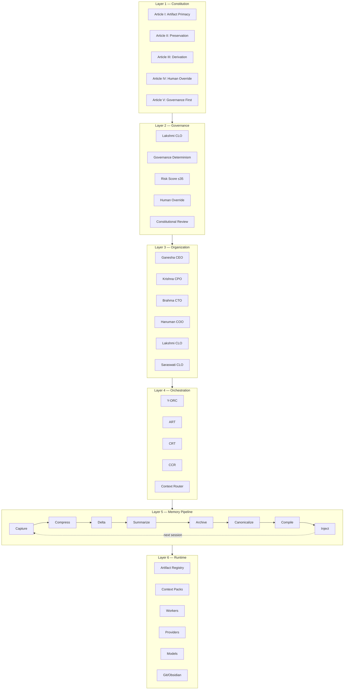

# Y-OS Organizational Digital Twin — Mermaid Fallback

*See [[YOS_Organizational_Digital_Twin.canvas]] for interactive Canvas version.*

```mermaid
graph TB
    subgraph L1["Layer 1 — Constitution"]
        A1[Article I: Artifact Primacy]
        A2[Article II: Preservation]
        A3[Article III: Derivation]
        A4[Article IV: Human Override]
        A5[Article V: Governance First]
    end
    subgraph L2["Layer 2 — Governance"]
        G1[Lakshmi CLO]
        G2[Governance Determinism]
        G3[Risk Score ≤35]
        G4[Human Override]
        G5[Constitutional Review]
    end
    subgraph L3["Layer 3 — Organization"]
        O1[Ganesha CEO]
        O2[Krishna CPO]
        O3[Brahma CTO]
        O4[Hanuman COO]
        O5[Lakshmi CLO]
        O6[Saraswati CLO]
    end
    subgraph L4["Layer 4 — Orchestration"]
        R1[Y-ORC]
        R2[ART]
        R3[CRT]
        R4[CCR]
        R5[Context Router]
    end
    subgraph L5["Layer 5 — Memory Pipeline"]
        M1[Capture] --> M2[Compress] --> M3[Delta] --> M4[Summarize]
        M4 --> M5[Archive] --> M6[Canonicalize] --> M7[Compile] --> M8[Inject]
        M8 -.->|next session| M1
    end
    subgraph L6["Layer 6 — Runtime"]
        RT1[Artifact Registry]
        RT2[Context Packs]
        RT3[Workers]
        RT4[Providers]
        RT5[Models]
        RT6[Git/Obsidian]
    end
    L1 --> L2 --> L3 --> L4 --> L5 --> L6
```
