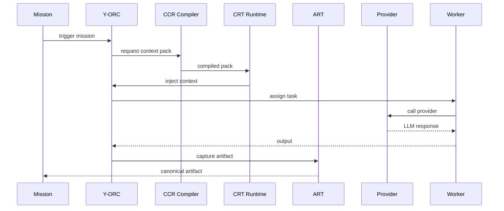

# Y-OS Runtime Flow — Mermaid Fallback

*See [[YOS_Runtime_Flow.canvas]] for interactive Canvas version.*

```mermaid
sequenceDiagram
    participant M as Mission
    participant YORC as Y-ORC
    participant CCR as CCR Compiler
    participant CRT as CRT Runtime
    participant ART as ART
    participant P as Provider
    participant W as Worker

    M->>YORC: trigger mission
    YORC->>CCR: request context pack
    CCR->>CRT: compiled pack
    CRT->>YORC: inject context
    YORC->>W: assign task
    W->>P: call provider
    P-->>W: LLM response
    W-->>YORC: output
    YORC->>ART: capture artifact
    ART-->>M: canonical artifact
```
