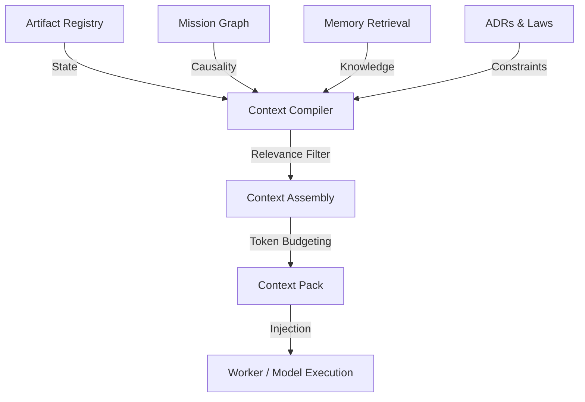

# Context Compiler Runtime (CCR) Architecture v1

**Date:** 2026-06-13  
**Status:** Canonical Reference  
**Mission:** CCR-001

## 1. Core Thesis

The best context is not the longest context. The best context is relevant, structured, fresh, canonical, minimal enough, complete enough, and actionable. A well-compiled Context Pack is strictly superior to raw conversation history.

## 2. Architecture

## 3. Inputs

- `Mission ID`: The bounding context.
- `Artifact Chain`: Causality and current state.
- `Relevant ADRs`: Architectural constraints.
- `Relevant Laws`: First principles and constitutional constraints.
- `Registry State`: Global context.
- `Open Loops`: Pending work.
- `Worker Role`: The target persona (e.g., Brahma).
- `Capability`: The target action (e.g., architecture).
- `Model Constraints`: Token limits and provider specifics.
- `Memory References`: Historical knowledge.

## 4. Processing Stages

1. **Retrieval:** Fetch all raw inputs based on `Mission ID`.
2. **Filtering:** Remove redundant or irrelevant data based on `Worker` and `Capability`.
3. **Assembly:** Structure the remaining data into the canonical schema.
4. **Budgeting:** Truncate or compress sections to fit the `Model` token limit.
5. **Compilation:** Output the final Context Pack (YAML/JSON).

## 5. Outputs

- `context_pack_<mission_id>.yaml`
- `context_pack_<mission_id>.md` (Human readable)

## 6. Integrations

- **Y-ORC:** Calls CCR before invoking ART.
- **ART:** Provides the `Worker` to CCR.
- **CRT:** Provides the `Model` constraints to CCR.
- **Lakshmi:** Scores the quality of the generated Context Pack.
- **Memory Layer:** Provides historical context to CCR.
