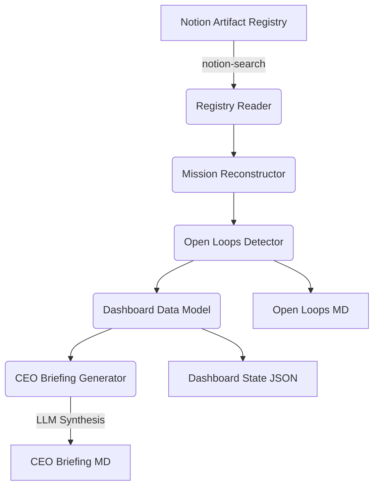

# Lakshmi Runtime Architecture v2

**Owner:** Chief Architect (Brahma)  
**Status:** Accepted  
**Date:** 2026-06-13  

## 1. Overview

The Lakshmi Runtime MVP v2 is the first operational visibility runtime of Y-OS. It reads the Artifact Registry (Notion), reconstructs mission chains using Artifact Lineage v1.1, detects open loops, and generates a CEO Briefing.

Lakshmi has authority over visibility, not execution.

## 2. Core Components

The runtime consists of six sequential components:

1. **Registry Reader:** Fetches all artifacts from the Notion DB.
2. **Mission Reconstructor:** Groups artifacts by `Mission ID` and builds the parent-child directed acyclic graph (DAG) to determine `Mission Status`.
3. **Open Loops Detector:** Applies rules to the DAG to find stalled artifacts, missing lineage, and blocked missions.
4. **Dashboard Data Model:** Structures the output into a JSON schema suitable for future UI rendering.
5. **CEO Briefing Generator:** Uses Claude Opus (via Manus proxy) to synthesize the data into a readable executive summary.
6. **Output Engine:** Writes Markdown and JSON files to disk.

## 3. Data Flow

## 4. Architectural Constraints

*   **Read-Only:** Lakshmi MVP v2 is strictly read-only against the Notion DB. It does not update artifact status (that is Y-ORC's future job).
*   **Stateless:** The runtime maintains no local database. The Notion Registry is the single source of truth.
*   **LLM Choice:** Cloud Opus (Anthropic) is prioritized for text synthesis and briefing generation per Y-OS text processing guidelines.

---

## Semantic Links

*Inferred by KGC v2 — MISSION-015*

- **executed_by:** [[Brahma]]
- **executed_by:** [[Lakshmi]]
- **governed_by:** [[Lakshmi_Governance]]
- **supersedes:** [[Lakshmi_Runtime_Architecture_v1]]
