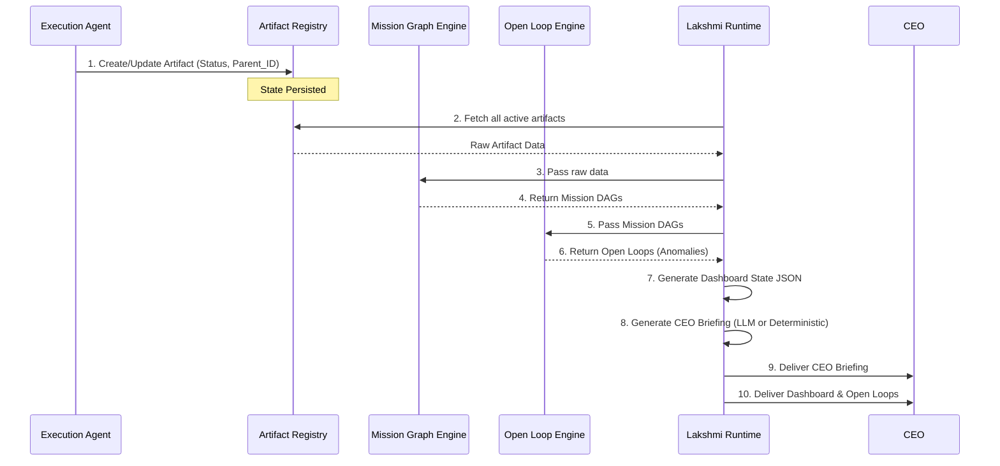

# Runtime Flow Diagram

**Owner:** Chief Architect (Brahma)  
**Status:** Accepted  
**Date:** 2026-06-13  

---

## Semantic Links

*Inferred by KGC v2 — MISSION-015*

- **executed_by:** [[Brahma]]
- **executed_by:** [[Lakshmi]]
- **governed_by:** [[Lakshmi_Governance]]
