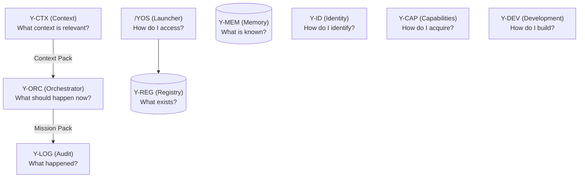

# Y-OS Core Architecture v1

**Auteur :** Manus AI
**Date :** 11 Juin 2026
**Statut :** Officiel

---

## 1. Vision Globale

Y-OS (Cognitive Operating System) est structuré autour d'un noyau fondamental composé de neuf modules interdépendants. L'objectif de cette architecture est de séparer strictement les responsabilités pour garantir la scalabilité, la clarté et l'extensibilité du système.

Ce document définit officiellement "ce qui existe", "ce qui est su", "quel contexte est pertinent", "ce qui doit arriver", "comment y accéder", "comment acquérir", "comment construire", "comment identifier" et "ce qui s'est passé".

---

## 2. System Modules vs Agent Roles

### Core Principle
Y-OS is built around **system functions**, not around agents.
Agents may change. Models may change. Tools may change. **System functions remain stable.**

Therefore:
**Modules are primary. Agents are secondary.**

### Architectural Rule
* **Modules** are system functions.
* **Agents** are operational roles.
* A module may be used by multiple agents.
* An agent may use multiple modules.
* A module must continue to exist even if a specific agent disappears.

---

## 3. Diagramme Logique (Updated Core Architecture)

---

## 4. Description des 9 Modules Fondamentaux

### 4.1. /YOS
* **Question :** *How do I access the system?*
* **Function :** Universal Launcher. Point d'entrée pour découvrir, naviguer, chercher et lancer.
* **Equivalent role :** Front Desk, Command Center.
* **Note :** /YOS lit Y-REG.

### 4.2. Y-REG
* **Question :** *What exists?*
* **Function :** Registry of capabilities, protocols, workflows, agents and system objects.
* **Equivalent role :** Registrar, Librarian, Asset Manager.
* **Note :** Stocke les objets système et les capacités. Ne stocke pas de mémoire.

### 4.3. Y-MEM
* **Question :** *What is known?*
* **Function :** Memory and knowledge management.
* **Equivalent role :** Archivist, Knowledge Officer.
* **Note :** Stocke la mémoire (décisions, historique, documents).

### 4.4. Y-CTX
* **Question :** *What context is relevant?*
* **Function :** Context extraction and assembly.
* **Produces :** Context Pack.
* **Equivalent role :** Analyst, Briefing Officer.
* **Note :** Y-CTX assemble le contexte, mais n'orchestre pas l'action.

### 4.5. Y-ORC
* **Question :** *What should happen now?*
* **Function :** Orchestration, routing, workflow planning and execution coordination.
* **Consumes :** Context Pack (from Y-CTX).
* **Produces :** Mission Pack.
* **Equivalent role :** COO, Chief of Staff, Operations Director.
* **Note :** Y-ORC orchestre l'action, mais ne stocke pas de mémoire.

### 4.6. Y-CAP
* **Question :** *How do we acquire new capabilities?*
* **Function :** Capability acquisition and system evolution.
* **Equivalent role :** Strategy Lead, Innovation Lead, Procurement Lead.

### 4.7. Y-DEV
* **Question :** *How do we build new capabilities?*
* **Function :** Capability development protocol.
* **Equivalent role :** CTO, Engineering Lead.

### 4.8. Y-ID
* **Question :** *How do we identify things?*
* **Function :** Naming, namespaces and identifiers.
* **Equivalent role :** Information Architect.

### 4.9. Y-LOG
* **Question :** *What happened?*
* **Function :** Audit trail and operational history.
* **Equivalent role :** Auditor, Operations Recorder.

---

## 5. Frontières et Clarifications Importantes

* **Y-CTX vs Y-ORC :** Y-CTX produit des *Context Packs* (l'analyse de la situation). Y-ORC consomme ces packs et produit des *Mission Packs* (le plan d'action). Y-CTX n'orchestre pas.
* **Y-ORC vs Y-MEM :** Y-ORC est le moteur d'exécution en temps réel. Il ne stocke aucune mémoire à long terme (c'est le rôle exclusif de Y-MEM).
* **Y-REG vs Y-MEM :** Y-REG stocke les objets du système (les outils, les protocoles). Y-MEM stocke la mémoire (les souvenirs, les connaissances).

---

## 6. Glossaire

* **Agent :** Operational role. Entité qui utilise les modules du système.
* **Module :** System function. Brique fondamentale stable du système.
* **Context Pack :** Assemblage d'informations pertinentes produit par Y-CTX pour une situation donnée.
* **Mission Pack :** Plan d'action routé et orchestré produit par Y-ORC.
