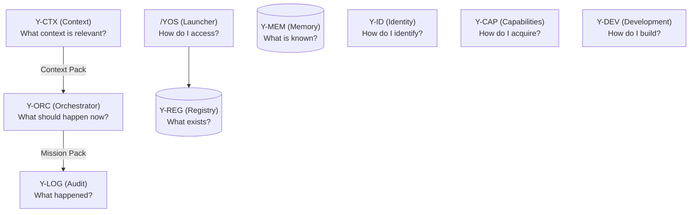

# Y-OS Core Architecture v1

**Auteur :** Manus AI
**Date :** 11 Juin 2026
**Statut :** Officiel

---

## 1. Vision Globale

Y-OS (Cognitive Operating System) est structuré autour d'un noyau fondamental composé de neuf modules interdépendants. L'objectif de cette architecture est de séparer strictement les responsabilités pour garantir la scalabilité, la clarté et l'extensibilité du système.

Ce document définit officiellement "ce qui existe", "ce qui est su", "quel contexte est pertinent", "ce qui doit arriver", "comment y accéder", "comment acquérir", "comment construire", "comment identifier" et "ce qui s'est passé".

---

## 2. System Functions vs Organizational Roles

### Core Principle
Y-OS is built around **system functions**, not around agents.
Agents may change. Models may change. Tools may change. **System functions remain stable.**

Therefore:
**Modules are primary. Agents are secondary.**

### Core Rule
* **System Modules are deterministic.**
* **Agents are non-deterministic.**

### System Modules
Modules provide system functions (e.g., Y-REG, Y-MEM, Y-CTX, Y-ORC).
Their mission is **not to think**. Their mission is to provide stable functions.

**Characteristics:**
* deterministic
* testable
* predictable
* reusable
* composable
* replaceable

*Modules execute functions. Modules do not exercise judgment.*

### Agents
Agents are organizational roles (e.g., PA, COO, Architect, Strategist, HR, CTO).
Their mission is **not merely to execute**. Their mission is to think, decide and coordinate.

**Characteristics:**
* adaptive
* interpretive
* strategic
* context-sensitive
* non-deterministic

Agents may choose an approach, define a strategy, break down complexity, select tools/workflows/agents, prioritize tasks, challenge assumptions, and escalate decisions.

*Agents exercise judgment.*

### Law #3
**Agents use modules. Modules do not replace agents.**
Modules provide cognitive and operational functions. Agents provide judgment, strategy and coordination.

---

## 3. Backend vs Frontend (Updated Mental Model)

**Backend = Cognition + Operational Infrastructure**
Includes all System Modules: Registry (Y-REG), Memory (Y-MEM), Context (Y-CTX), Orchestration (Y-ORC), Development (Y-DEV), Capability Management (Y-CAP), Identity (Y-ID), Logging (Y-LOG).

**Frontend = Organization + Decision Making**
Includes all Organizational Roles: PA, COO, Architect, Strategist, HR, CTO, Specialists.

Roles consume modules. Modules never replace roles.
Y-OS is not an agent system. Y-OS is a **Cognitive Operating System**.
Agents, models, and tools are replaceable. Cognitive functions are foundational.

---

## 4. Diagramme Logique (Updated Core Architecture)

---

## 5. Description des 9 Modules Fondamentaux

### 5.1. /YOS
* **Question :** *How do I access the system?*
* **Function :** Universal Launcher. Point d'entrée pour découvrir, naviguer, chercher et lancer.
* **Equivalent role :** Front Desk, Command Center.
* **Note :** /YOS lit Y-REG.

### 5.2. Y-REG
* **Question :** *What exists?*
* **Function :** Registry of capabilities, protocols, workflows, agents and system objects.
* **Equivalent role :** Registrar, Librarian, Asset Manager.
* **Note :** Stocke les objets système et les capacités. Ne stocke pas de mémoire.

### 5.3. Y-MEM
* **Question :** *What is known?*
* **Function :** Memory and knowledge management.
* **Equivalent role :** Archivist, Knowledge Officer.
* **Note :** Stocke la mémoire (décisions, historique, documents).

### 5.4. Y-CTX
* **Question :** *What context is relevant?*
* **Function :** Context extraction and assembly.
* **Produces :** Context Pack.
* **Equivalent role :** Analyst, Briefing Officer.
* **Note :** Y-CTX assemble le contexte, mais n'orchestre pas l'action.

### 5.5. Y-ORC
* **Question :** *What should happen now?*
* **Function :** Orchestration, routing, workflow planning and execution coordination.
* **Consumes :** Context Pack (from Y-CTX).
* **Produces :** Mission Pack.
* **Equivalent role :** COO, Chief of Staff, Operations Director.
* **Note :** Y-ORC orchestre l'action, mais ne stocke pas de mémoire.

### 5.6. Y-CAP
* **Question :** *How do we acquire new capabilities?*
* **Function :** Capability acquisition and system evolution.
* **Equivalent role :** Strategy Lead, Innovation Lead, Procurement Lead.

### 5.7. Y-DEV
* **Question :** *How do we build new capabilities?*
* **Function :** Capability development protocol.
* **Equivalent role :** CTO, Engineering Lead.

### 5.8. Y-ID
* **Question :** *How do we identify things?*
* **Function :** Naming, namespaces and identifiers.
* **Equivalent role :** Information Architect.

### 5.9. Y-LOG
* **Question :** *What happened?*
* **Function :** Audit trail and operational history.
* **Equivalent role :** Auditor, Operations Recorder.

---

## 6. Frontières et Clarifications Importantes

* **COO vs Y-ORC :** Important distinction. **Y-ORC** is system orchestration (routing, planning, execution logic). **COO** is operational orchestration (deciding approach, selecting agents/tools, prioritizing). Y-ORC is a system function; COO is an organizational role. The COO uses Y-ORC. The COO is not Y-ORC.
* **Y-CTX vs Y-ORC :** Y-CTX produit des *Context Packs* (l'analyse de la situation). Y-ORC consomme ces packs et produit des *Mission Packs* (le plan d'action). Y-CTX n'orchestre pas.
* **Y-ORC vs Y-MEM :** Y-ORC est le moteur d'exécution en temps réel. Il ne stocke aucune mémoire à long terme (c'est le rôle exclusif de Y-MEM).
* **Y-REG vs Y-MEM :** Y-REG stocke les objets du système (les outils, les protocoles). Y-MEM stocke la mémoire (les souvenirs, les connaissances).

---

## 7. Architecture Freeze v1

> **No new core modules may be created without demonstrating that the responsibility cannot be assigned to one of the existing 9 modules.**

Current Core Modules (frozen):

| Module | Question |
|--------|----------|
| /YOS | How do I access? |
| Y-REG | What exists? |
| Y-MEM | What is known? |
| Y-CTX | What context is relevant? |
| Y-ORC | What should happen now? |
| Y-CAP | How do I acquire? |
| Y-DEV | How do I build? |
| Y-ID | How do I identify? |
| Y-LOG | What happened? |

Any proposed new module must be submitted with a written justification demonstrating that none of the 9 existing modules can absorb the responsibility. The burden of proof is on the proposer.

---

## 8. Glossaire

* **Agent :** Organizational role. Entité non-déterministe qui pense, décide et coordonne en utilisant les modules du système.
* **Module :** System function. Brique fondamentale stable et déterministe du système.
* **Context Pack :** Assemblage d'informations pertinentes produit par Y-CTX pour une situation donnée.
* **Mission Pack :** Plan d'action routé et orchestré produit par Y-ORC.
