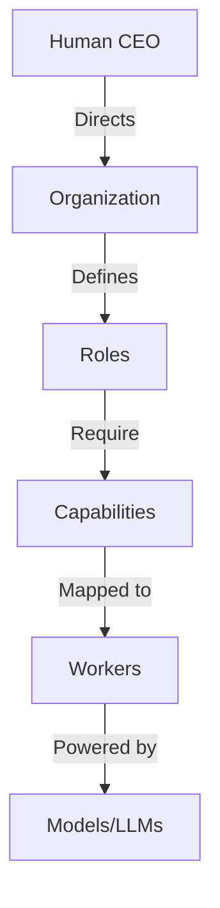
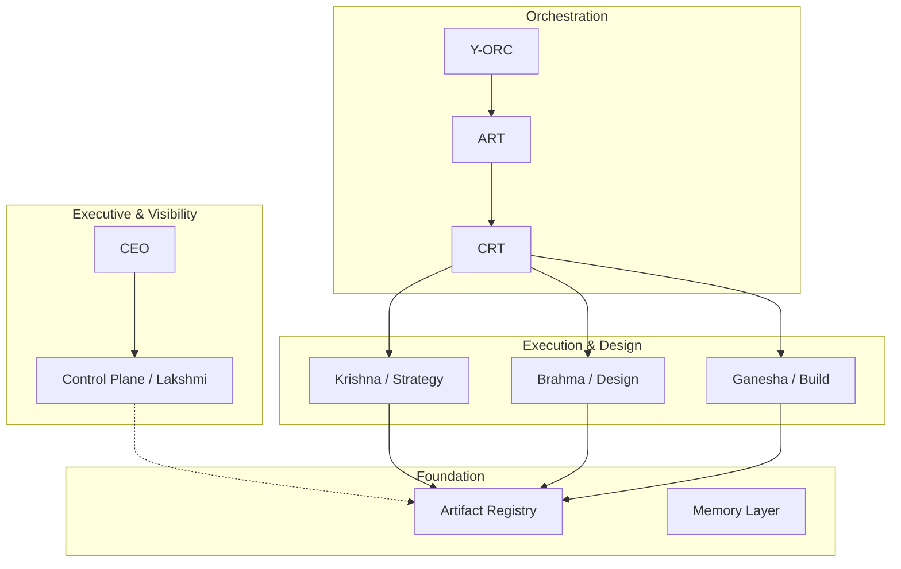
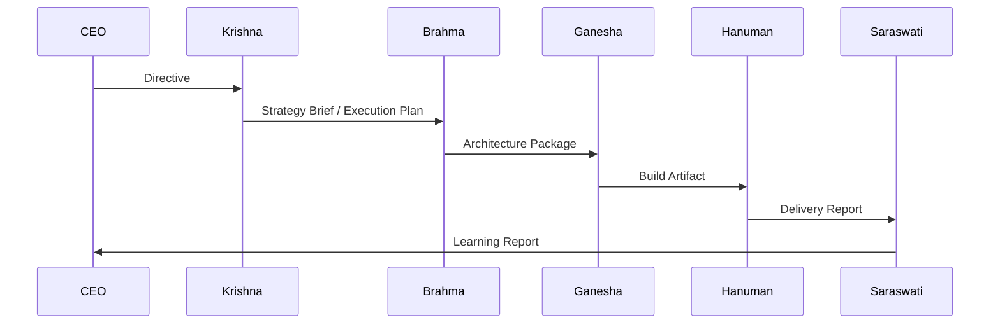
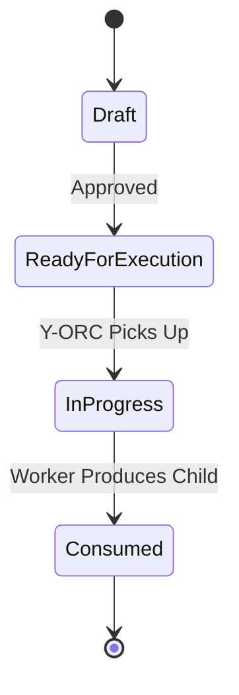

# Y-OS Master Architecture Atlas v1

**Date:** 2026-06-13  
**Status:** Canonical Reference

---

## 1. Executive Summary

### What is Y-OS?
Y-OS is a **Personal Cognitive Operating System**. It is not a software application, but a socio-technical architecture designed to organize human and artificial intelligence into a unified, scalable, and resilient cognitive entity.

### Why does it exist?
Traditional AI tools are agent-centric: humans prompt agents, agents produce outputs, and the cognitive context is lost when the chat window closes. Y-OS exists to solve the problem of **cognitive continuity and scaling**. It shifts the paradigm from "chatting with bots" to "managing a cognitive organization."

### Core Concepts
- **Artifact-Centric Organization:** State, decisions, and knowledge live in persistent artifacts, not in the ephemeral memories of AI agents.
- **AI-Native Organization:** Designed from the ground up for asynchronous, parallel, and autonomous AI execution.
- **Human + AI Hybrid System:** The human acts as the CEO and Chief Architect, directing strategy and governance, while AI workers handle execution and synthesis.
- **Cognitive Infrastructure:** Provides the routing, memory, and orchestration layers necessary for complex, multi-step cognitive work.

---

## 2. First Principles

Y-OS is built upon immutable laws that dictate its design and operation.

1. **Agents are transient.** They can be created, destroyed, or replaced at any time without impacting the system.
2. **Artifacts are persistent.** They are the sole source of truth and the only mechanism for state transfer.
3. **Capabilities are replaceable.** The organization routes work based on what needs to be done, not who does it.
4. **Memory is cumulative.** Knowledge compounds in the Artifact Registry, independent of any single model's context window.
5. **Organization survives component replacement.** The system's identity is defined by its structure and artifacts, not its underlying LLMs.
6. **Organization > Agents > Models.** The organizational structure dictates agent roles; agents utilize models. This hierarchy is strict.

---

## 3. Y-OS Theory of Organization

### The Primacy of Organization
Organizations are the primary abstraction in Y-OS because they outlive their members. A well-designed organization can swap out every single worker and still produce the exact same value. 

### Roles over Identities
Agents are merely organizational roles (e.g., "Lead Builder", "CSO"). They are defined by their capabilities and the artifacts they produce/consume, not by their internal logic or the specific LLM powering them.

### Artifacts as Communication
Direct agent-to-agent communication is prohibited. All communication occurs via artifacts. Worker A produces an artifact; the system routes it; Worker B consumes the artifact. This ensures total observability and asynchronous decoupling.

### Separation of Memory and Execution
Execution is stateless. Memory is stateful. Workers do not "remember" past tasks; they are injected with the exact necessary context (Context Packs) retrieved from the persistent memory layer (Artifact Registry) at runtime.

### The Capability Hierarchy

---

## 4. Organizational Structure

The Y-OS organization is composed of distinct roles, each with specific missions and artifact interfaces.

### CEO (Yannick)
- **Mission:** Set vision, strategy, and ultimate governance.
- **Authority:** Absolute.
- **Artifacts Produced:** Directives, Strategic Intents.
- **Artifacts Consumed:** CEO Briefings, Escalations.

### CSO (Chief Strategy Officer) — Krishna
- **Mission:** Deep research, strategy formulation, and knowledge synthesis.
- **Artifacts Produced:** Strategy Briefs, Research Outputs, Execution Plans.
- **Artifacts Consumed:** Directives, Raw Data.

### COO (Chief Operating Officer) — Ganesha
- **Mission:** Execution, implementation, and reporting.
- **Artifacts Produced:** Build Artifacts, Execution Reports.
- **Artifacts Consumed:** Execution Plans, Architecture Packages.

### Chief Architect — Brahma
- **Mission:** System design, architectural review, and structural integrity.
- **Artifacts Produced:** Architecture Packages, ADRs, Reviews.
- **Artifacts Consumed:** Strategy Briefs, Execution Plans.

### Lead Builder — Hanuman
- **Mission:** Delivery, deployment, and handoff operations.
- **Artifacts Produced:** Delivery Reports, Deployed Systems.
- **Artifacts Consumed:** Build Artifacts.

### ECO (Executive Coordination Officer) — Lakshmi
- **Mission:** Governance, observability, and control plane management.
- **Artifacts Produced:** Governance Reports, CEO Briefings.
- **Artifacts Consumed:** All Artifacts (Read-only visibility).

### CODO (Chief Data/Knowledge Officer) — Saraswati
- **Mission:** Summarization, knowledge compression, and learning extraction.
- **Artifacts Produced:** Learning Reports, Summaries.
- **Artifacts Consumed:** Delivery Reports, Execution Logs.

---

## 5. Layer Architecture

Y-OS is divided into strict horizontal layers.

1. **Executive Layer:** Human CEO setting direction.
2. **Visibility Layer:** Control Plane (Lakshmi) providing dashboards and alerts.
3. **Execution Layer:** Orchestration (Y-ORC) routing work.
4. **Design Layer:** Architecture (Brahma) and Strategy (Krishna) defining the *how*.
5. **Build Layer:** Execution (Ganesha) creating the actual outputs.
6. **Evolution Layer:** Learning (Saraswati) extracting reusable knowledge.
7. **Artifact Layer:** The Registry holding all state.
8. **Capability Layer:** The abstract functions required to do work.
9. **Memory Layer:** Long-term storage (Notion, Git).

---

## 6. Operational Value Chain (OVC)

The OVC describes how intent becomes reality through a sequence of artifacts.

| Phase | Producer | Consumer | Artifact | Acceptance Rules |
| :--- | :--- | :--- | :--- | :--- |
| **Strategy** | CEO | Krishna | Directive | Must have clear objective. |
| **Planning** | Krishna | Brahma | Strategy Brief | Must define scope and constraints. |
| **Design** | Brahma | Ganesha | Architecture Pkg | Must resolve all technical unknowns. |
| **Build** | Ganesha | Hanuman | Build Artifact | Must pass all tests/constraints. |
| **Delivery** | Hanuman | Saraswati | Delivery Report | Must be deployed/accessible. |
| **Learning** | Saraswati | CEO | Learning Report | Must extract reusable knowledge. |

---

## 7. Artifact Layer

The Artifact Layer is the database of the organization.

- **Artifact Registry:** The central database (Notion) storing every artifact.
- **Artifact Status Framework:** `Not started` -> `In progress` -> `Review` -> `Done` (Consumed).
- **Artifact Lineage:** Every artifact points to its parent (`URI` field), creating an unbroken chain of causality.
- **Mission Graph:** The DAG (Directed Acyclic Graph) formed by tracing lineage from the final output back to the original CEO Directive.

