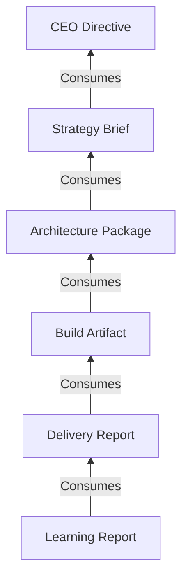
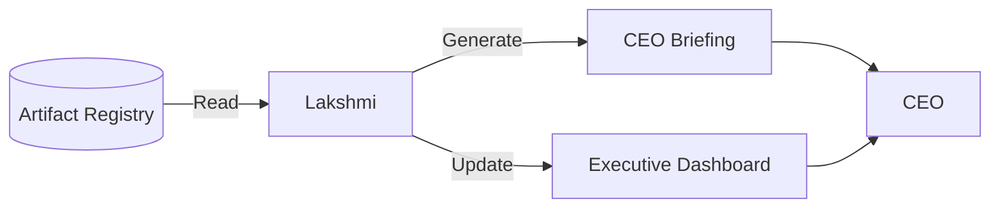
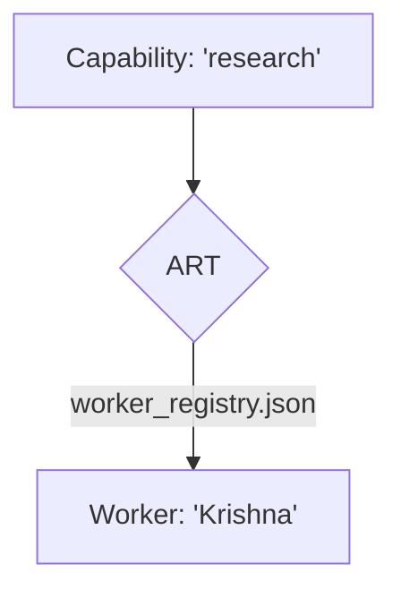

## 8. Artifact Catalog

| Artifact Type | Purpose | Producer | Consumer |
| :--- | :--- | :--- | :--- |
| **Directive** | Initiates a mission | CEO | Krishna / Y-ORC |
| **Strategy Brief** | Defines the approach | Krishna | Brahma |
| **Execution Plan** | Breaks down tasks | Krishna | Ganesha |
| **Architecture Package** | Technical specs | Brahma | Ganesha |
| **Build Artifact** | The actual work/code | Ganesha | Hanuman |
| **Delivery Report** | Confirms deployment | Hanuman | Saraswati |
| **Learning Report** | Extracts knowledge | Saraswati | CEO |
| **Governance Report** | Audits compliance | Lakshmi | CEO |

---

## 9. Artifact Lineage

Lineage is the memory of causality. It answers: *Why does this exist?*

- **Vertical Lineage:** Child -> Parent (e.g., Build Artifact -> Architecture Package).
- **Horizontal Lineage:** Peer relationships (e.g., Frontend Build -> Backend Build).
- **Transversal Lineage:** Cross-mission references (e.g., Architecture Package -> ADR-0026).

---

## 10. Mission Architecture

A **Mission** is a bounded set of work aimed at a specific objective.
- **Mission Graph:** The collection of all artifacts sharing the same `Mission ID`.
- **Open Loops:** Artifacts with status `Not started` or `In progress`. A mission is complete only when zero open loops remain.
- **Mission Health:** Monitored by Lakshmi. Evaluates time-in-status, error rates, and cost against budget.

---

## 11. Control Plane

The Control Plane is the nervous system of Y-OS. It provides visibility without execution.

**Components:**
1. **Artifact Registry:** The database.
2. **Artifact Lineage:** The relationships.
3. **Mission Graph Engine:** Calculates overall progress.
4. **Lakshmi Runtime:** The observer agent.

**Why it matters:** Governance precedes orchestration. You cannot manage what you cannot see. The Control Plane ensures the CEO always has a real-time, accurate view of the organization's state without needing to interrupt workers.

---

## 12. Lakshmi Architecture

Lakshmi is the Executive Coordination Officer. She is **read-only** regarding operational artifacts.

**Responsibilities:**
- **Open Loop Monitoring:** Detects stalled artifacts.
- **Executive Dashboard:** Maintains the high-level view for the CEO.
- **CEO Briefings:** Synthesizes mission progress into concise updates.
- **Governance Monitoring:** Flags violations of First Principles (e.g., missing lineage).

---

## 13. Y-ORC Architecture

Y-ORC (Y-OS Orchestrator) is the execution coordination layer. It transforms state into action.

**Core Loop:**
1. **Watcher:** Polls the Registry for `Status=Not started` and `Consumer=System`.
2. **Resolver:** Reads the requested `Capability`.
3. **Router:** Calls ART to find the worker.
4. **Executor:** Invokes the worker.
5. **Writer:** Commits the output artifact and updates lineage.

Y-ORC is completely blind to agent names and models. It only knows about capabilities and artifacts.

---

## 14. ART Architecture

ART (Agent Routing Table) is the directory that maps Capabilities to Workers.

- **Configurable:** Lives in `worker_registry.json`.
- **Decoupled:** Allows swapping workers (e.g., upgrading "Krishna v1" to "Krishna v2") without touching Y-ORC code.

---

## Semantic Links

*Inferred by KGC v2 — MISSION-015*

- **executed_by:** [[Brahma]]
- **executed_by:** [[Ganesha]]
- **executed_by:** [[Lakshmi]]
- **executed_by:** [[Saraswati]]
- **executed_by:** [[Hanuman]]
- **executed_by:** [[Krishna]]
- **governed_by:** [[Lakshmi_Governance]]
- **references:** [[ADR-0026]]
