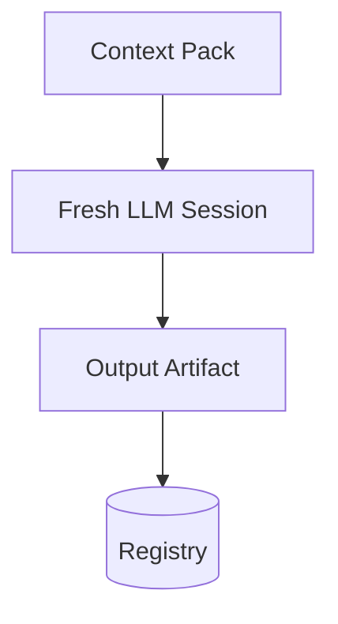

## 15. CRT Architecture (Future)

CRT (Capability Routing Table) is the final layer of the routing stack. It maps Workers to specific LLM Models.

**Flow:**
`Worker` -> `CRT` -> `Model`

**Features:**
- **Model Selection:** Chooses the best model based on the task (e.g., Claude 3.5 for coding, Gemini 1.5 for huge context).
- **Cost Routing:** Routes low-priority tasks to cheaper models.
- **Fallback Routing:** Automatically switches providers if an API is down.

---

## 16. Capability Layer

The Capability Layer defines the actual engines of work.

- **Manus:** Internal agentic execution, browser automation, tool use.
- **ChatGPT / Claude / Gemini:** Text processing, reasoning, generation.
- **MCP Servers:** Direct integration with external tools (e.g., Notion, GitHub).
- **APIs & Automations:** Deterministic workflows (e.g., n8n, Zapier).
- **Python Runtimes:** Custom scripts and data processing.

Y-OS abstracts these away. The organization requests a capability; the routing layers (ART/CRT) find the right engine.

---

## 17. Memory Architecture

Memory in Y-OS is explicit and persistent.

- **Episodic Memory:** Session logs, execution traces.
- **Semantic Memory:** The Artifact Registry, Knowledge Graph, Obsidian notes.
- **Procedural Memory:** ADRs, Python scripts, Workflow definitions.

Memory is injected into fresh execution sessions via **Context Packs**, ensuring the system never relies on hidden, ephemeral LLM chat history.

---

## 18. Context Continuity Architecture

To prevent cognitive drift and vendor lock-in, Y-OS uses **Stateless Context Packs**.

**Context Pack Composition:**
1. Canonical Context (Constitution, Laws)
2. Mission Context (Objective, Constraints)
3. Artifact Context (Input data, Lineage)

When Y-ORC invokes a worker, it passes this Context Pack. The worker executes in a fresh session, produces the artifact, and the session is discarded. This guarantees reproducibility and provider independence.

---

## 19. Runtime Architecture

The complete, end-to-end runtime stack.

1. **Artifact:** A new request is created in the Registry.
2. **Y-ORC:** Detects the artifact and reads its required capability.
3. **Capability:** e.g., `research`.
4. **ART:** Resolves `research` to Worker `Krishna`.
5. **Worker:** `Krishna` is invoked with a Context Pack.
6. **CRT (Future):** Resolves `Krishna` to Model `claude-3-5-sonnet`.
7. **Model:** Executes the reasoning/generation.
8. **Artifact:** Output is written back to the Registry with lineage.

---

## 20. End-to-End Example

**Mission:** "Analyze the competitor landscape for Product X."

1. **CEO Request:** Creates `Directive` artifact.
2. **Y-ORC -> Strategy:** Routes to Krishna.
3. **Krishna:** Produces `Strategy Brief` (defines competitors to analyze).
4. **Y-ORC -> Plan:** Routes to Krishna.
5. **Krishna:** Produces `Execution Plan` (step-by-step research tasks).
6. **Y-ORC -> Execute:** Routes to Ganesha (via Manus).
7. **Ganesha:** Scrapes web, produces `Build Artifact` (raw data).
8. **Y-ORC -> Summarize:** Routes to Saraswati.
9. **Saraswati:** Produces `Learning Report` (final synthesis).
10. **Lakshmi:** Observes completion, generates `CEO Briefing`.

All steps are autonomous, asynchronous, and fully observable in the Registry.

---

## 21. Future Roadmap

### Implemented (Foundational)
- Constitution & First Principles
- Theory of Organization
- Control Plane & Lakshmi MVP
- Y-ORC Runtime v1
- ART Runtime v1
- CCV-001 (Context Continuity)

### In Progress (Operational)
- **CRT Runtime v1:** Dynamic model routing.
- **Lakshmi Closed Loop:** Automated anomaly detection and escalation.

### Planned (Advanced)
- **Multi-Agent Runtime:** Swarm execution for parallel tasks.
- **Memory OS:** Deep semantic graph integration.
- **CasaTAO & YFamily:** Specialized domains running on Y-OS.
