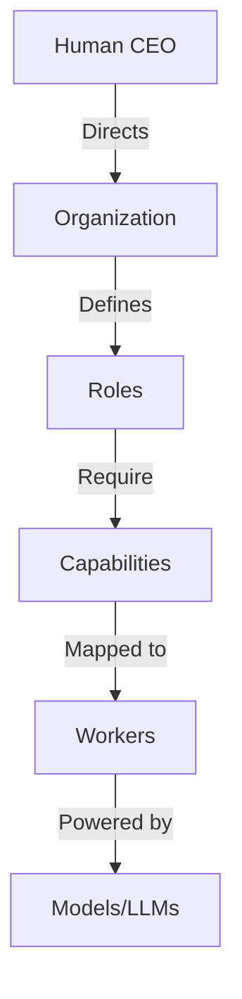
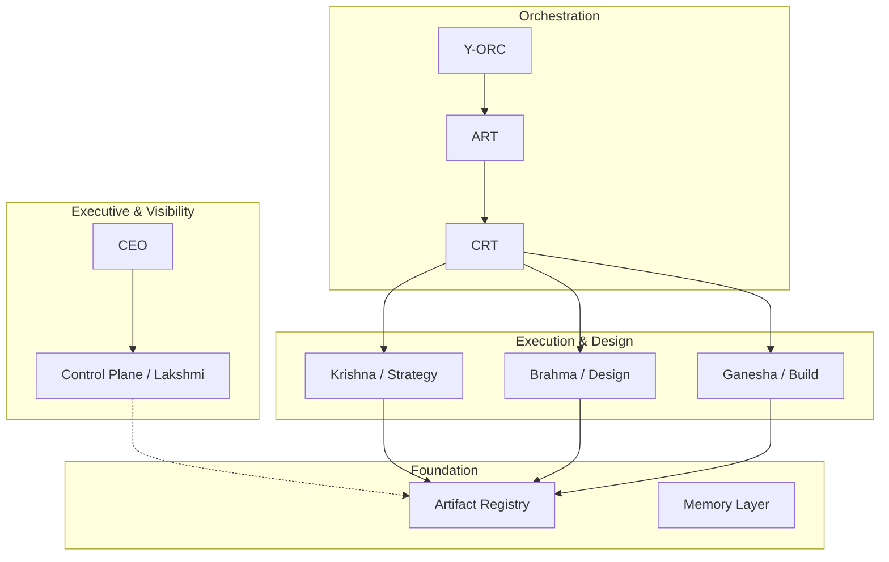
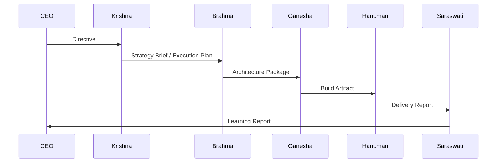
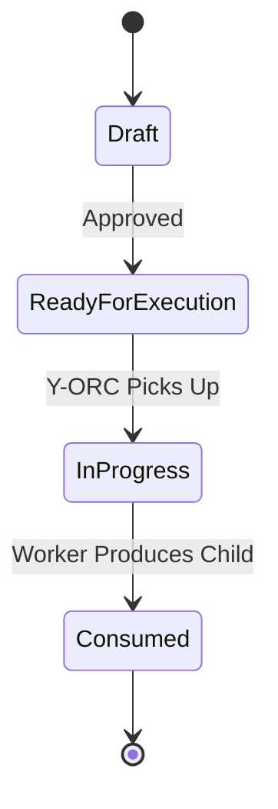
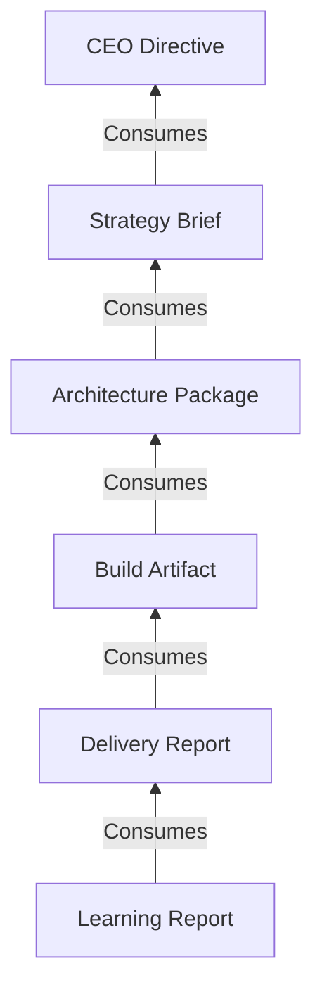
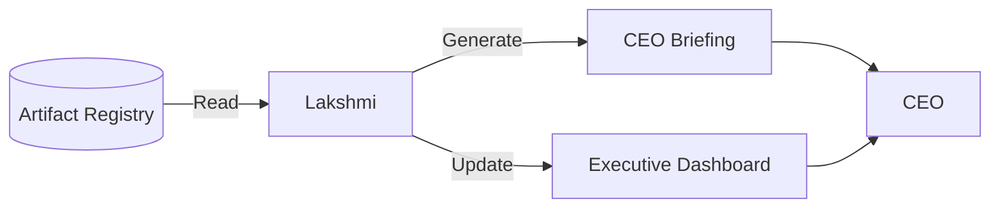
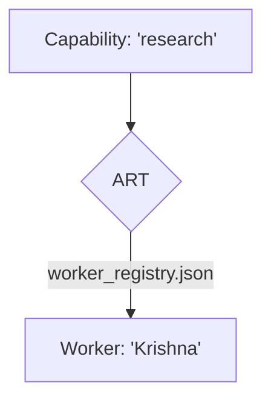
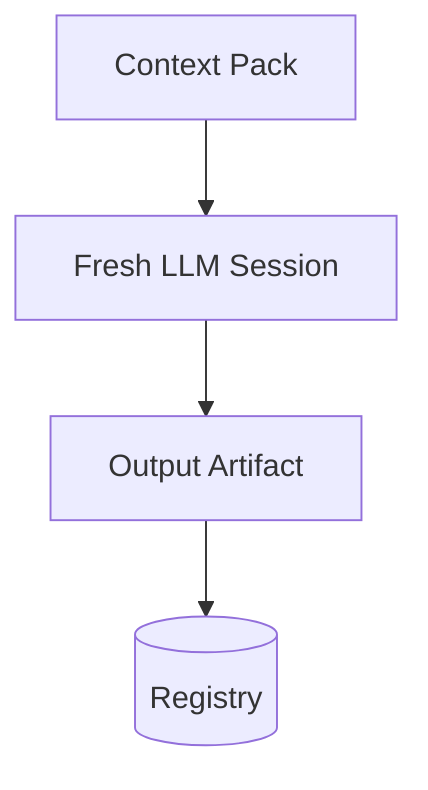

# Y-OS Master Architecture Atlas v1

**Date:** 2026-06-13  
**Status:** Canonical Reference

---

## 1. Executive Summary

### What is Y-OS?
Y-OS is a **Personal Cognitive Operating System**. It is not a software application, but a socio-technical architecture designed to organize human and artificial intelligence into a unified, scalable, and resilient cognitive entity.

### Why does it exist?
Traditional AI tools are agent-centric: humans prompt agents, agents produce outputs, and the cognitive context is lost when the chat window closes. Y-OS exists to solve the problem of **cognitive continuity and scaling**. It shifts the paradigm from "chatting with bots" to "managing a cognitive organization."

### Core Concepts
- **Artifact-Centric Organization:** State, decisions, and knowledge live in persistent artifacts, not in the ephemeral memories of AI agents.
- **AI-Native Organization:** Designed from the ground up for asynchronous, parallel, and autonomous AI execution.
- **Human + AI Hybrid System:** The human acts as the CEO and Chief Architect, directing strategy and governance, while AI workers handle execution and synthesis.
- **Cognitive Infrastructure:** Provides the routing, memory, and orchestration layers necessary for complex, multi-step cognitive work.

---

## 2. First Principles

Y-OS is built upon immutable laws that dictate its design and operation.

1. **Agents are transient.** They can be created, destroyed, or replaced at any time without impacting the system.
2. **Artifacts are persistent.** They are the sole source of truth and the only mechanism for state transfer.
3. **Capabilities are replaceable.** The organization routes work based on what needs to be done, not who does it.
4. **Memory is cumulative.** Knowledge compounds in the Artifact Registry, independent of any single model's context window.
5. **Organization survives component replacement.** The system's identity is defined by its structure and artifacts, not its underlying LLMs.
6. **Organization > Agents > Models.** The organizational structure dictates agent roles; agents utilize models. This hierarchy is strict.

---

## 3. Y-OS Theory of Organization

### The Primacy of Organization
Organizations are the primary abstraction in Y-OS because they outlive their members. A well-designed organization can swap out every single worker and still produce the exact same value. 

### Roles over Identities
Agents are merely organizational roles (e.g., "Lead Builder", "CSO"). They are defined by their capabilities and the artifacts they produce/consume, not by their internal logic or the specific LLM powering them.

### Artifacts as Communication
Direct agent-to-agent communication is prohibited. All communication occurs via artifacts. Worker A produces an artifact; the system routes it; Worker B consumes the artifact. This ensures total observability and asynchronous decoupling.

### Separation of Memory and Execution
Execution is stateless. Memory is stateful. Workers do not "remember" past tasks; they are injected with the exact necessary context (Context Packs) retrieved from the persistent memory layer (Artifact Registry) at runtime.

### The Capability Hierarchy

---

## 4. Organizational Structure

The Y-OS organization is composed of distinct roles, each with specific missions and artifact interfaces.

### CEO (Yannick)
- **Mission:** Set vision, strategy, and ultimate governance.
- **Authority:** Absolute.
- **Artifacts Produced:** Directives, Strategic Intents.
- **Artifacts Consumed:** CEO Briefings, Escalations.

### CSO (Chief Strategy Officer) — Krishna
- **Mission:** Deep research, strategy formulation, and knowledge synthesis.
- **Artifacts Produced:** Strategy Briefs, Research Outputs, Execution Plans.
- **Artifacts Consumed:** Directives, Raw Data.

### COO (Chief Operating Officer) — Ganesha
- **Mission:** Execution, implementation, and reporting.
- **Artifacts Produced:** Build Artifacts, Execution Reports.
- **Artifacts Consumed:** Execution Plans, Architecture Packages.

### Chief Architect — Brahma
- **Mission:** System design, architectural review, and structural integrity.
- **Artifacts Produced:** Architecture Packages, ADRs, Reviews.
- **Artifacts Consumed:** Strategy Briefs, Execution Plans.

### Lead Builder — Hanuman
- **Mission:** Delivery, deployment, and handoff operations.
- **Artifacts Produced:** Delivery Reports, Deployed Systems.
- **Artifacts Consumed:** Build Artifacts.

### ECO (Executive Coordination Officer) — Lakshmi
- **Mission:** Governance, observability, and control plane management.
- **Artifacts Produced:** Governance Reports, CEO Briefings.
- **Artifacts Consumed:** All Artifacts (Read-only visibility).

### CODO (Chief Data/Knowledge Officer) — Saraswati
- **Mission:** Summarization, knowledge compression, and learning extraction.
- **Artifacts Produced:** Learning Reports, Summaries.
- **Artifacts Consumed:** Delivery Reports, Execution Logs.

---

## 5. Layer Architecture

Y-OS is divided into strict horizontal layers.

1. **Executive Layer:** Human CEO setting direction.
2. **Visibility Layer:** Control Plane (Lakshmi) providing dashboards and alerts.
3. **Execution Layer:** Orchestration (Y-ORC) routing work.
4. **Design Layer:** Architecture (Brahma) and Strategy (Krishna) defining the *how*.
5. **Build Layer:** Execution (Ganesha) creating the actual outputs.
6. **Evolution Layer:** Learning (Saraswati) extracting reusable knowledge.
7. **Artifact Layer:** The Registry holding all state.
8. **Capability Layer:** The abstract functions required to do work.
9. **Memory Layer:** Long-term storage (Notion, Git).

---

## 6. Operational Value Chain (OVC)

The OVC describes how intent becomes reality through a sequence of artifacts.

| Phase | Producer | Consumer | Artifact | Acceptance Rules |
| :--- | :--- | :--- | :--- | :--- |
| **Strategy** | CEO | Krishna | Directive | Must have clear objective. |
| **Planning** | Krishna | Brahma | Strategy Brief | Must define scope and constraints. |
| **Design** | Brahma | Ganesha | Architecture Pkg | Must resolve all technical unknowns. |
| **Build** | Ganesha | Hanuman | Build Artifact | Must pass all tests/constraints. |
| **Delivery** | Hanuman | Saraswati | Delivery Report | Must be deployed/accessible. |
| **Learning** | Saraswati | CEO | Learning Report | Must extract reusable knowledge. |

---

## 7. Artifact Layer

The Artifact Layer is the database of the organization.

- **Artifact Registry:** The central database (Notion) storing every artifact.
- **Artifact Status Framework:** `Not started` -> `In progress` -> `Review` -> `Done` (Consumed).
- **Artifact Lineage:** Every artifact points to its parent (`URI` field), creating an unbroken chain of causality.
- **Mission Graph:** The DAG (Directed Acyclic Graph) formed by tracing lineage from the final output back to the original CEO Directive.

## 8. Artifact Catalog

| Artifact Type | Purpose | Producer | Consumer |
| :--- | :--- | :--- | :--- |
| **Directive** | Initiates a mission | CEO | Krishna / Y-ORC |
| **Strategy Brief** | Defines the approach | Krishna | Brahma |
| **Execution Plan** | Breaks down tasks | Krishna | Ganesha |
| **Architecture Package** | Technical specs | Brahma | Ganesha |
| **Build Artifact** | The actual work/code | Ganesha | Hanuman |
| **Delivery Report** | Confirms deployment | Hanuman | Saraswati |
| **Learning Report** | Extracts knowledge | Saraswati | CEO |
| **Governance Report** | Audits compliance | Lakshmi | CEO |

---

## 9. Artifact Lineage

Lineage is the memory of causality. It answers: *Why does this exist?*

- **Vertical Lineage:** Child -> Parent (e.g., Build Artifact -> Architecture Package).
- **Horizontal Lineage:** Peer relationships (e.g., Frontend Build -> Backend Build).
- **Transversal Lineage:** Cross-mission references (e.g., Architecture Package -> ADR-0026).

---

## 10. Mission Architecture

A **Mission** is a bounded set of work aimed at a specific objective.
- **Mission Graph:** The collection of all artifacts sharing the same `Mission ID`.
- **Open Loops:** Artifacts with status `Not started` or `In progress`. A mission is complete only when zero open loops remain.
- **Mission Health:** Monitored by Lakshmi. Evaluates time-in-status, error rates, and cost against budget.

---

## 11. Control Plane

The Control Plane is the nervous system of Y-OS. It provides visibility without execution.

**Components:**
1. **Artifact Registry:** The database.
2. **Artifact Lineage:** The relationships.
3. **Mission Graph Engine:** Calculates overall progress.
4. **Lakshmi Runtime:** The observer agent.

**Why it matters:** Governance precedes orchestration. You cannot manage what you cannot see. The Control Plane ensures the CEO always has a real-time, accurate view of the organization's state without needing to interrupt workers.

---

## 12. Lakshmi Architecture

Lakshmi is the Executive Coordination Officer. She is **read-only** regarding operational artifacts.

**Responsibilities:**
- **Open Loop Monitoring:** Detects stalled artifacts.
- **Executive Dashboard:** Maintains the high-level view for the CEO.
- **CEO Briefings:** Synthesizes mission progress into concise updates.
- **Governance Monitoring:** Flags violations of First Principles (e.g., missing lineage).

---

## 13. Y-ORC Architecture

Y-ORC (Y-OS Orchestrator) is the execution coordination layer. It transforms state into action.

**Core Loop:**
1. **Watcher:** Polls the Registry for `Status=Not started` and `Consumer=System`.
2. **Resolver:** Reads the requested `Capability`.
3. **Router:** Calls ART to find the worker.
4. **Executor:** Invokes the worker.
5. **Writer:** Commits the output artifact and updates lineage.

Y-ORC is completely blind to agent names and models. It only knows about capabilities and artifacts.

---

## 14. ART Architecture

ART (Agent Routing Table) is the directory that maps Capabilities to Workers.

- **Configurable:** Lives in `worker_registry.json`.
- **Decoupled:** Allows swapping workers (e.g., upgrading "Krishna v1" to "Krishna v2") without touching Y-ORC code.

## 15. CRT Architecture (Future)

CRT (Capability Routing Table) is the final layer of the routing stack. It maps Workers to specific LLM Models.

**Flow:**
`Worker` -> `CRT` -> `Model`

**Features:**
- **Model Selection:** Chooses the best model based on the task (e.g., Claude 3.5 for coding, Gemini 1.5 for huge context).
- **Cost Routing:** Routes low-priority tasks to cheaper models.
- **Fallback Routing:** Automatically switches providers if an API is down.

---

## 16. Capability Layer

The Capability Layer defines the actual engines of work.

- **Manus:** Internal agentic execution, browser automation, tool use.
- **ChatGPT / Claude / Gemini:** Text processing, reasoning, generation.
- **MCP Servers:** Direct integration with external tools (e.g., Notion, GitHub).
- **APIs & Automations:** Deterministic workflows (e.g., n8n, Zapier).
- **Python Runtimes:** Custom scripts and data processing.

Y-OS abstracts these away. The organization requests a capability; the routing layers (ART/CRT) find the right engine.

---

## 17. Memory Architecture

Memory in Y-OS is explicit and persistent.

- **Episodic Memory:** Session logs, execution traces.
- **Semantic Memory:** The Artifact Registry, Knowledge Graph, Obsidian notes.
- **Procedural Memory:** ADRs, Python scripts, Workflow definitions.

Memory is injected into fresh execution sessions via **Context Packs**, ensuring the system never relies on hidden, ephemeral LLM chat history.

---

## 18. Context Continuity Architecture

To prevent cognitive drift and vendor lock-in, Y-OS uses **Stateless Context Packs**.

**Context Pack Composition:**
1. Canonical Context (Constitution, Laws)
2. Mission Context (Objective, Constraints)
3. Artifact Context (Input data, Lineage)

When Y-ORC invokes a worker, it passes this Context Pack. The worker executes in a fresh session, produces the artifact, and the session is discarded. This guarantees reproducibility and provider independence.

---

## 19. Runtime Architecture

The complete, end-to-end runtime stack.

1. **Artifact:** A new request is created in the Registry.
2. **Y-ORC:** Detects the artifact and reads its required capability.
3. **Capability:** e.g., `research`.
4. **ART:** Resolves `research` to Worker `Krishna`.
5. **Worker:** `Krishna` is invoked with a Context Pack.
6. **CRT (Future):** Resolves `Krishna` to Model `claude-3-5-sonnet`.
7. **Model:** Executes the reasoning/generation.
8. **Artifact:** Output is written back to the Registry with lineage.

---

## 20. End-to-End Example

**Mission:** "Analyze the competitor landscape for Product X."

1. **CEO Request:** Creates `Directive` artifact.
2. **Y-ORC -> Strategy:** Routes to Krishna.
3. **Krishna:** Produces `Strategy Brief` (defines competitors to analyze).
4. **Y-ORC -> Plan:** Routes to Krishna.
5. **Krishna:** Produces `Execution Plan` (step-by-step research tasks).
6. **Y-ORC -> Execute:** Routes to Ganesha (via Manus).
7. **Ganesha:** Scrapes web, produces `Build Artifact` (raw data).
8. **Y-ORC -> Summarize:** Routes to Saraswati.
9. **Saraswati:** Produces `Learning Report` (final synthesis).
10. **Lakshmi:** Observes completion, generates `CEO Briefing`.

All steps are autonomous, asynchronous, and fully observable in the Registry.

---

## 21. Future Roadmap

### Implemented (Foundational)
- Constitution & First Principles
- Theory of Organization
- Control Plane & Lakshmi MVP
- Y-ORC Runtime v1
- ART Runtime v1
- CCV-001 (Context Continuity)

### In Progress (Operational)
- **CRT Runtime v1:** Dynamic model routing.
- **Lakshmi Closed Loop:** Automated anomaly detection and escalation.

### Planned (Advanced)
- **Multi-Agent Runtime:** Swarm execution for parallel tasks.
- **Memory OS:** Deep semantic graph integration.
- **CasaTAO & YFamily:** Specialized domains running on Y-OS.
