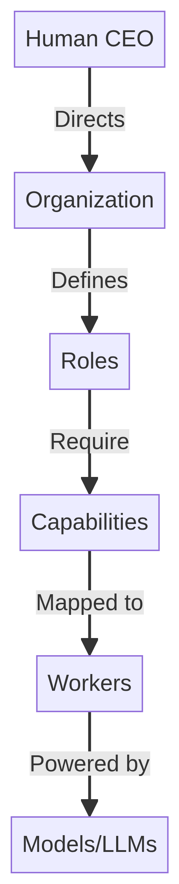
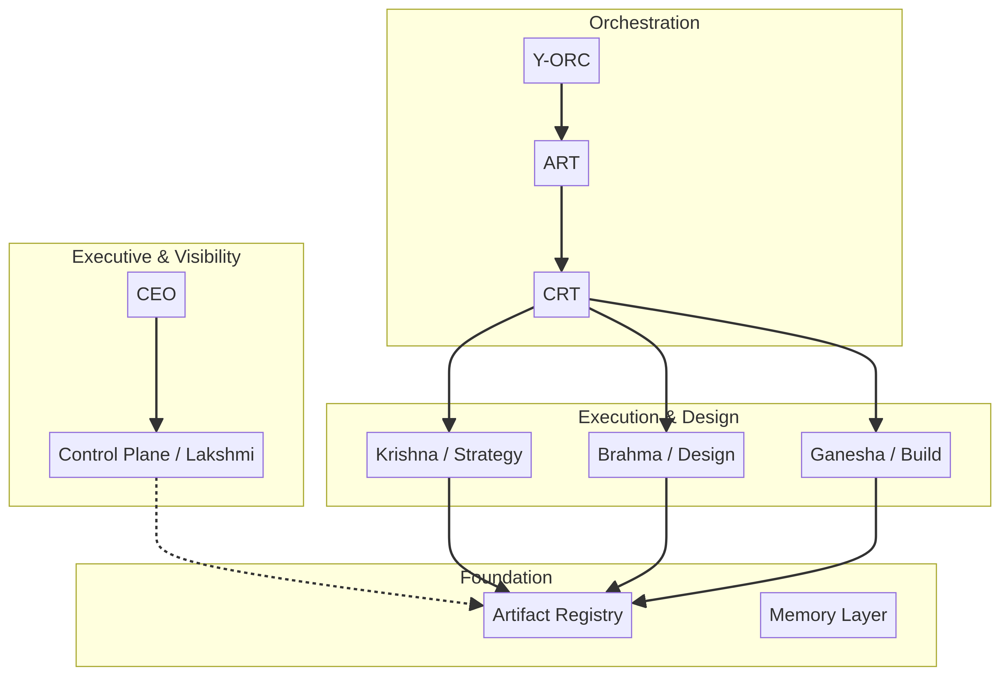
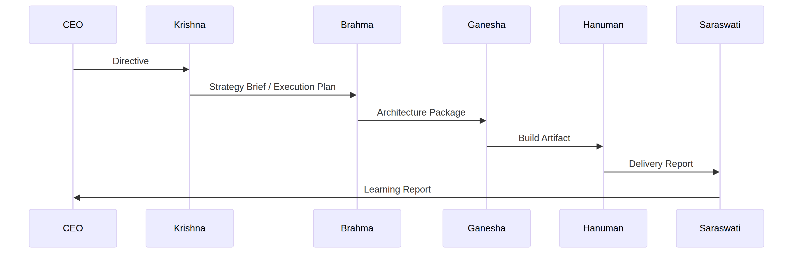
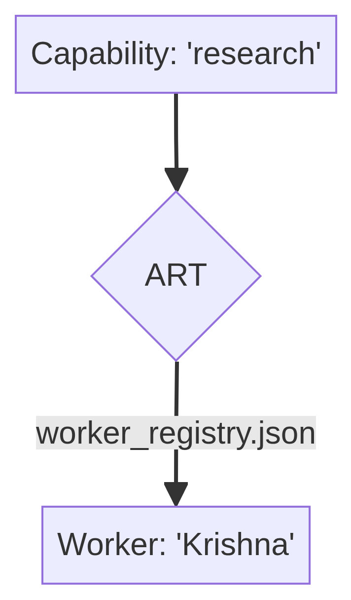
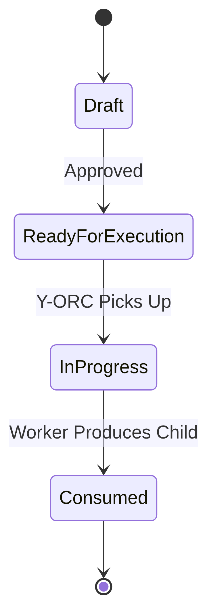
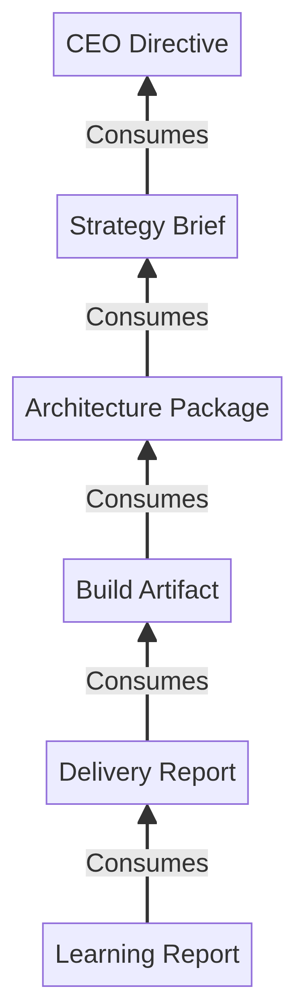
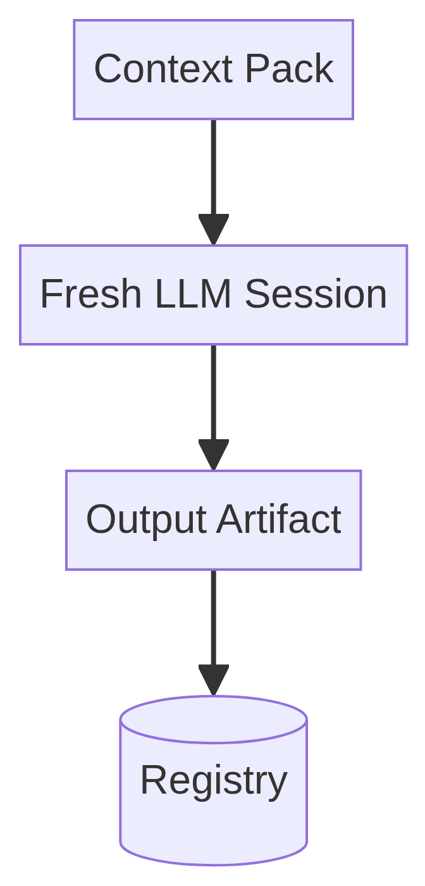
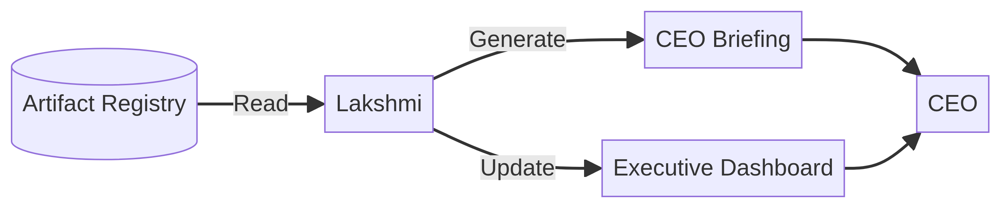

# Y-OS Master Architecture Atlas v1.1

**Date:** 2026-06-13  
**Revised:** 2026-06-13  
**Status:** Canonical Reference — Corrected  
**Author:** Brahma (Chief Architect) / Manus AI

> *"A new architect should be able to understand Y-OS completely by reading this document."*

---

## Table of Contents

1. Executive Summary
2. First Principles
3. Theory of Organization
4. Organizational Structure
5. Layer Architecture
6. Operational Value Chain
7. Artifact Layer
8. Artifact Catalog
9. Artifact Lineage
10. Mission Architecture
11. Control Plane
12. Lakshmi Architecture
13. Y-ORC Architecture
14. ART Architecture
15. CRT Architecture (Future)
16. Capability Layer
17. Memory Architecture
18. Context Continuity Architecture
19. Runtime Architecture
20. End-to-End Example
21. Future Roadmap

---

## 1. Executive Summary

### What is Y-OS?
Y-OS is a **Personal Cognitive Operating System**. It is not a software application, but a socio-technical architecture designed to organize human and artificial intelligence into a unified, scalable, and resilient cognitive entity.

### Why does it exist?
Traditional AI tools are agent-centric: humans prompt agents, agents produce outputs, and the cognitive context is lost when the chat window closes. Y-OS exists to solve the problem of **cognitive continuity and scaling**. It shifts the paradigm from "chatting with bots" to "managing a cognitive organization."

### Core Concepts

| Concept | Definition |
| :--- | :--- |
| **Artifact-Centric Organization** | State, decisions, and knowledge live in persistent artifacts, not in the ephemeral memories of AI agents. |
| **AI-Native Organization** | Designed from the ground up for asynchronous, parallel, and autonomous AI execution. |
| **Human + AI Hybrid System** | The human acts as the CEO and Chief Architect, directing strategy and governance, while AI workers handle execution and synthesis. |
| **Cognitive Infrastructure** | Provides the routing, memory, and orchestration layers necessary for complex, multi-step cognitive work. |

---

## 2. First Principles

Y-OS is built upon immutable laws that dictate its design and operation.

| # | Law | Implication |
| :---: | :--- | :--- |
| 1 | **Agents are transient.** | They can be replaced at any time without impacting the system. |
| 2 | **Artifacts are persistent.** | They are the sole source of truth and the only mechanism for state transfer. |
| 3 | **Capabilities are replaceable.** | The organization routes work based on *what* needs to be done, not *who* does it. |
| 4 | **Memory is cumulative.** | Knowledge compounds in the Artifact Registry, independent of any single model's context window. |
| 5 | **Organization survives component replacement.** | The system's identity is defined by its structure and artifacts, not its underlying LLMs. |
| 6 | **Organization > Agents > Models.** | This hierarchy is strict and non-negotiable. |

---

## 3. Y-OS Theory of Organization

### The Primacy of Organization
Organizations are the primary abstraction in Y-OS because they outlive their members. A well-designed organization can swap out every single worker and still produce the exact same value.

### Roles over Identities
Agents are merely organizational roles (e.g., "Lead Builder", "CSO"). They are defined by their capabilities and the artifacts they produce and consume, not by their internal logic or the specific LLM powering them.

### Artifacts as Communication
Direct agent-to-agent communication is prohibited. All communication occurs via artifacts. Worker A produces an artifact; the system routes it; Worker B consumes the artifact. This ensures total observability and asynchronous decoupling.

### The Capability Hierarchy



---

## 4. Organizational Structure

| Role | Agent | Mission | Artifacts Produced | Artifacts Consumed |
| :--- | :--- | :--- | :--- | :--- |
| **CEO** | Yannick | Vision, strategy, governance | Directives | CEO Briefings, Delivery Reports |
| **CSO** | Krishna | Defines *what* and *why*. Strategy only. | Strategy Briefs | Directives |
| **COO** | Ganesha | Defines *when* and *who*. Owns delivery validation. | Execution Plans, Delivery Reports | Strategy Briefs, Build Reports |
| **Chief Architect** | Brahma | Defines *how*. Does not build. | Architecture Packages, ADRs | Execution Plans |
| **Lead Builder** | Hanuman | Builds. Does not redesign architecture. | Build Artifact, Build Report | Architecture Packages |
| **ECO** | Lakshmi | Provides visibility. Read-only unless delegated by CEO. | CEO Briefings, Open Loop Reports | All (read-only) |
| **CODO** | Saraswati | Improves the organization. Produces doctrine updates. | Learning Reports, Governance Improvements | Delivery Reports |

---

## 5. Layer Architecture



| Layer | Purpose | Key Components |
| :--- | :--- | :--- |
| **Executive** | Direction | CEO |
| **Visibility** | Observability | Control Plane, Lakshmi |
| **Orchestration** | Routing | Y-ORC, ART, CRT |
| **Execution** | Work | Krishna, Brahma, Ganesha |
| **Artifact** | State | Registry, Lineage |
| **Memory** | Persistence | Notion, Git |

---

## 6. Operational Value Chain



| Phase | Producer | Consumer | Artifact | Acceptance Rules |
| :--- | :--- | :--- | :--- | :--- |
| **Strategy** | CEO → Krishna (CSO) | Ganesha (COO) | Strategy Brief | Must define what and why. |
| **Execution Planning** | Ganesha (COO) | Brahma (Chief Architect) | Execution Plan | Must define when and who. |
| **Design** | Brahma (Chief Architect) | Hanuman (Lead Builder) | Architecture Package | Must resolve all technical unknowns. |
| **Build** | Hanuman (Lead Builder) | Ganesha (COO) | Build Artifact + Build Report | Must pass all tests/constraints. |
| **Delivery** | Ganesha (COO) | CEO / Krishna | Delivery Report | Must be deployed/accessible. |
| **Learning** | Saraswati (CODO) | Y-OS System / CEO | Learning Report | Must extract reusable knowledge. |
| **Visibility** (parallel) | Lakshmi (ECO) | CEO | CEO Briefing, Open Loop Report | Read-only across all artifacts. |

---

## 7. Artifact Layer

The Artifact Layer is the database of the organization.

- **Artifact Registry:** The central database (Notion) storing every artifact.
- **Artifact Status Framework:** `Draft` → `Ready For Execution` → `In Progress` → `Consumed`.
- **Artifact Lineage:** Every artifact points to its parent (`URI` field), creating an unbroken chain of causality.



---

## 8. Artifact Catalog

| Artifact Type | Purpose | Producer | Consumer |
| :--- | :--- | :--- | :--- |
| **Directive** | Initiates a mission | CEO | Krishna / Y-ORC |
| **Strategy Brief** | Defines the approach | Krishna | Brahma |
| **Execution Plan** | Breaks down tasks | Krishna | Ganesha |
| **Architecture Package** | Technical specs | Brahma | Ganesha |
| **Build Artifact** | The actual work/code | Ganesha | Hanuman |
| **Delivery Report** | Confirms deployment | Hanuman | Saraswati |
| **Learning Report** | Extracts knowledge | Saraswati | CEO |
| **Governance Report** | Audits compliance | Lakshmi | CEO |

---

## 9. Artifact Lineage

Lineage is the memory of causality. It answers: *Why does this exist?*

- **Vertical Lineage:** Child → Parent (e.g., Build Artifact → Architecture Package).
- **Horizontal Lineage:** Peer relationships (e.g., Frontend Build → Backend Build).
- **Transversal Lineage:** Cross-mission references (e.g., Architecture Package → ADR-0026).



---

## 10. Mission Architecture

A **Mission** is a bounded set of work aimed at a specific objective.

- **Mission Graph:** The collection of all artifacts sharing the same `Mission ID`.
- **Open Loops:** Artifacts with status `Not started` or `In progress`. A mission is complete only when zero open loops remain.
- **Mission Health:** Monitored by Lakshmi. Evaluates time-in-status, error rates, and cost against budget.

---

## 11. Control Plane

The Control Plane is the nervous system of Y-OS. It provides visibility without execution.

**Components:** Artifact Registry, Artifact Lineage, Mission Graph Engine, Lakshmi Runtime.

> **Why it matters:** Governance precedes orchestration. You cannot manage what you cannot see. The Control Plane ensures the CEO always has a real-time, accurate view of the organization's state without needing to interrupt workers.

---

## 12. Lakshmi Architecture

Lakshmi is the Executive Coordination Officer. She is **read-only** regarding operational artifacts.



**Responsibilities:** Open Loop Monitoring, Executive Dashboard, CEO Briefings, Governance Monitoring.

---

## 13. Y-ORC Architecture

Y-ORC (Y-OS Orchestrator) is the execution coordination layer. It transforms state into action.

**Core Loop:** Watcher → Resolver → Router → Executor → Writer.

Y-ORC is completely blind to agent names and models. It only knows about capabilities and artifacts.

---

## 14. ART Architecture

ART (Agent Routing Table) maps Capabilities to Workers via a configurable `worker_registry.json`.



---

## 15. CRT Architecture (Future)

CRT (Capability Routing Table) maps Workers to specific LLM Models.

**Features:** Model Selection, Cost Routing, Quality Routing, Fallback Routing, Multi-LLM Routing.

---

## 16. Capability Layer

| Engine | Role in Y-OS |
| :--- | :--- |
| **Manus** | Agentic execution, browser automation, tool use |
| **Claude / ChatGPT / Gemini** | Text processing, reasoning, generation |
| **MCP Servers** | Direct integration with external tools |
| **APIs & Automations** | Deterministic workflows (n8n, Zapier) |
| **Python Runtimes** | Custom scripts and data processing |

---

## 17. Memory Architecture

| Memory Type | Storage | Examples |
| :--- | :--- | :--- |
| **Episodic** | Session logs, execution traces | `yorc_v1_execution_log.jsonl` |
| **Semantic** | Artifact Registry, Knowledge Graph | Notion, Obsidian |
| **Procedural** | ADRs, scripts, workflows | Git, `worker_registry.json` |

---

## 18. Context Continuity Architecture

Y-OS uses **Stateless Context Packs** to prevent cognitive drift and vendor lock-in.



**Validated by CCV-001:** Mode B (Fresh Session + Context Pack) passed the first controlled validation test and is accepted as the canonical baseline for Y-OS cognitive continuity. Stateful sessions may be used as optional provider-specific cache or acceleration mechanisms, but they are not the source of truth and must never replace Context Packs.

> **Canonical Rule:** Context Pack = source of cognitive continuity. Stateful session = optional optimization. Registry + Artifacts = source of organizational truth.

*Note: CCV-001 validates the direction, not the entire provider landscape. More provider-level tests are required before generalizing across all LLMs and task types.*

---

## 19. Runtime Architecture

The complete, end-to-end runtime stack:

```
Artifact → Y-ORC → Capability → ART → Worker → CRT → Model → Artifact
```

| Step | Component | Knows | Does NOT Know |
| :--- | :--- | :--- | :--- |
| 1 | Artifact Registry | State | Routing |
| 2 | Y-ORC | Capabilities | Agent names |
| 3 | ART | Workers | Models |
| 4 | CRT (future) | Models | Business logic |
| 5 | Worker | Execution | Routing |

---

## 20. End-to-End Example

**Mission:** "Analyze the competitor landscape for Product X."

| Step | Actor | Input | Output |
| :--- | :--- | :--- | :--- |
| 1 | CEO | — | `Directive` |
| 2 | Y-ORC → Krishna (CSO) | Directive | `Strategy Brief` |
| 3 | Y-ORC → Ganesha (COO) | Strategy Brief | `Execution Plan` |
| 4 | Y-ORC → Brahma (Chief Architect) | Execution Plan | `Architecture Package` |
| 5 | Y-ORC → Hanuman (Lead Builder) | Architecture Package | `Build Artifact` + `Build Report` |
| 6 | Y-ORC → Ganesha (COO) | Build Report | `Delivery Report` |
| 7 | Y-ORC → Saraswati (CODO) | Delivery Report | `Learning Report` |
| 8 | Lakshmi (ECO) | All artifacts (read-only) | `CEO Briefing` + `Open Loop Report` |

All steps are autonomous, asynchronous, and fully observable in the Registry.

---

## 21. Future Roadmap

| Status | Component | Description |
| :--- | :--- | :--- |
| ✅ Implemented | Constitution & First Principles | Foundational doctrine |
| ✅ Implemented | Y-ORC Runtime v1 | Autonomous artifact loop |
| ✅ Implemented | ART Runtime v1 | Capability-based routing |
| ✅ Implemented | CCV-001 | Context continuity validated |
| 🔄 In Progress | CRT Runtime v1 | Dynamic model routing |
| 🔄 In Progress | Lakshmi Closed Loop | Automated anomaly detection |
| 📋 Planned | Multi-Agent Runtime | Swarm execution |
| 📋 Planned | Memory OS | Deep semantic graph |
| 📋 Planned | CasaTAO / YFamily | Domain-specific Y-OS instances |
