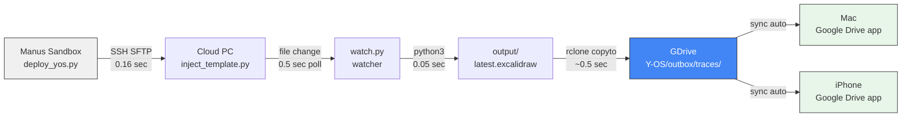

# Y-OS Tools Reference
> Last updated: 2026-06-15 | Session: Visual Execution Trace System

---

## 1. Infrastructure

### Cloud PC (N100 — Manus Cloud Computer)
| Champ | Valeur |
|---|---|
| Rôle | Nœud d'exécution persistant Y-OS — scripts, watcher, génération de traces |
| IP | `34.148.90.222` |
| User | `ubuntu` |
| Password | `3fegdzjhaEKwG8CxVQf8wZ` (stocker dans 1Password) |
| Connexion Mac | `ssh ubuntu@34.148.90.222` ou via **Termius** |
| Connexion iPhone | **Termius** (app iOS) |
| OS | Ubuntu 24.04 |
| Python | 3.12.3 |
| Packages installés | `rclone v1.74.3`, `paramiko`, `python3` |
| Firewall | ufw — port 22 uniquement |

**Lessons learned :**
- Le mount FUSE `/mnt/8cd489ill4h7i3u4ougzia68g/ubuntu/` dans le sandbox Manus **ne reflète pas** le vrai home du Cloud PC — toujours déployer via SSH/SFTP (paramiko).
- `nohup python3 watch.py &` doit être lancé depuis le vrai home, pas via le mount.

---

### rclone (GDrive sync)
| Champ | Valeur |
|---|---|
| Rôle | Upload automatique des livrables Y-OS vers Google Drive |
| Version | v1.74.3 |
| Remote configuré | `gdrive` (Google Drive de yannick.jolliet@gmail.com) |
| Config path | `~/.config/rclone/rclone.conf` sur Cloud PC |
| Auth type | OAuth2 — token refresh automatique |
| Token expiry | Auto-refresh (refresh_token permanent) |

**Auth one-time setup (à refaire si token expiré) :**
1. Sur Mac : `rclone authorize "drive" "eyJzY29wZSI6ImRyaXZlIn0"`
2. Autoriser dans browser Google
3. Copier le JSON token affiché dans le terminal Mac
4. Sur Cloud PC : `rclone config` → edit remote `gdrive` → coller le token

**Lessons learned :**
- `--auth-no-open-browser` nécessaire sur le Cloud PC (pas de browser).
- L'auth se fait en 2 terminaux : Cloud PC (Termius) + Mac (Terminal).
- `rclone mkdir` crée les dossiers GDrive même s'ils n'existent pas encore.

---

## 2. Y-OS GDrive Structure

```
GDrive/
└── Y-OS/
    ├── inbox/
    │   ├── to-process/     ← Yannick dépose → Y-OS traite
    │   └── processed/      ← Y-OS déplace après traitement
    ├── outbox/
    │   ├── traces/         ← Excalidraw (.excalidraw) — nommage: YYYY-MM-DD_MISSION-ID
    │   ├── reports/        ← Rapports (.md, .pdf)
    │   ├── data/           ← Schémas JSON, CSV
    │   ├── code/           ← Scripts Python, shell
    │   └── media/          ← Images, vidéos générées
    └── archive/            ← Livrables > 30 jours (auto-archivé)
        └── YYYY-MM/
```

**Règle de nommage :**
- Traces : `YYYY-MM-DD_MISSION-ID.excalidraw`
- Rapports : `YYYY-MM-DD_TITRE.md`
- Données : `YYYY-MM-DD_SCHEMA-ID.json`

---

## 3. Scripts Y-OS sur Cloud PC

### `~/yOS/watch.py` — Watcher daemon
| Champ | Valeur |
|---|---|
| Rôle | Surveille `inject_template.py`, génère trace + upload GDrive |
| Lancement | `nohup python3 ~/yOS/watch.py >> ~/yOS/watch.log 2>&1 &` |
| Log | `~/yOS/watch.log` |
| Polling | 0.5 sec |
| Output local | `~/yOS/outbox/traces/output/latest.excalidraw` |
| Output GDrive | `gdrive:Y-OS/outbox/traces/YYYY-MM-DD_MISSION-ID.excalidraw` |
| Perf | ~0.75 sec bout-en-bout (SSH write → fichier GDrive) |

**Relancer si mort :**
```bash
nohup python3 ~/yOS/watch.py >> ~/yOS/watch.log 2>&1 &
```

### `~/yOS/outbox/traces/inject_template.py` — Injecteur de trace
| Champ | Valeur |
|---|---|
| Rôle | Clone `template_reference.excalidraw`, substitue les champs NEW{} |
| Déclenchement | Modification du fichier → watcher détecte → génère |
| Perf | ~0.05 sec (sans matplotlib) |

### `~/yOS/outbox/traces/template_reference.excalidraw`
| Champ | Valeur |
|---|---|
| Rôle | Template canonique — style hand-drawn sketch, fond blanc, 9 colonnes |
| Standard | Consulting infographic, CEO-readable 30 sec, A4-printable |

---

## 4. Manus Sandbox

### deploy_yos.py
| Champ | Valeur |
|---|---|
| Rôle | Déploie les fichiers du sandbox Manus → Cloud PC via paramiko SFTP |
| Path | `/home/ubuntu/deploy_yos.py` |
| Usage | `python3 deploy_yos.py` |

**Pattern SSH non-bloquant (paramiko) :**
```python
chan = ssh.get_transport().open_session()
chan.exec_command("commande &")  # fire-and-forget
time.sleep(2)
# lire log séparément
```

**Lessons learned :**
- `ssh.exec_command()` bloque si la commande ne se termine pas → utiliser `open_session()` + `exec_command()` séparément.
- Toujours utiliser `timeout` sur les scripts de déploiement.
- Le mount FUSE `/mnt/` est en lecture seule pour les opérations critiques.

---

## 5. Termius

| Champ | Valeur |
|---|---|
| Rôle | Client SSH cross-platform (iPhone + Mac) |
| Usage | Connexion au Cloud PC pour maintenance, lancement watcher, rclone config |
| Sync | iPhone ↔ Mac automatique |
| Download Mac | https://termius.com/mac-os |
| Host configuré | `34.148.90.222` / `ubuntu` / password stocké |

---

## 6. Pipeline complet — Flux de données



**Temps total bout-en-bout : ~0.75 sec** (Manus écrit → fichier dans GDrive)

---

## 7. Checklist de remise en service

Si le système est inactif après redémarrage du Cloud PC :

```bash
# 1. Vérifier watcher
pgrep -a -f 'watch.py'

# 2. Relancer si absent
nohup python3 ~/yOS/watch.py >> ~/yOS/watch.log 2>&1 &

# 3. Vérifier rclone
rclone listremotes

# 4. Test rapide
touch ~/yOS/outbox/traces/inject_template.py
sleep 2
ls ~/yOS/outbox/traces/output/
cat ~/yOS/watch.log | tail -5
```
