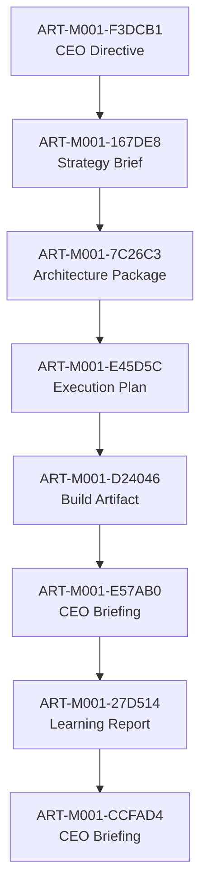

# Mission Graph — MISSION-001

```mermaid
graph TD
    ART-M001-F3DCB1["ART-M001-F3DCB1\nCEO Directive"]
    ART-M001-167DE8["ART-M001-167DE8\nStrategy Brief"]
    ART-M001-F3DCB1 --> ART-M001-167DE8
    ART-M001-7C26C3["ART-M001-7C26C3\nArchitecture Package"]
    ART-M001-167DE8 --> ART-M001-7C26C3
    ART-M001-E45D5C["ART-M001-E45D5C\nExecution Plan"]
    ART-M001-7C26C3 --> ART-M001-E45D5C
    ART-M001-D24046["ART-M001-D24046\nBuild Artifact"]
    ART-M001-E45D5C --> ART-M001-D24046
    ART-M001-E57AB0["ART-M001-E57AB0\nCEO Briefing"]
    ART-M001-D24046 --> ART-M001-E57AB0
    ART-M001-27D514["ART-M001-27D514\nLearning Report"]
    ART-M001-E57AB0 --> ART-M001-27D514
    ART-M001-CCFAD4["ART-M001-CCFAD4\nCEO Briefing"]
    ART-M001-27D514 --> ART-M001-CCFAD4
```
