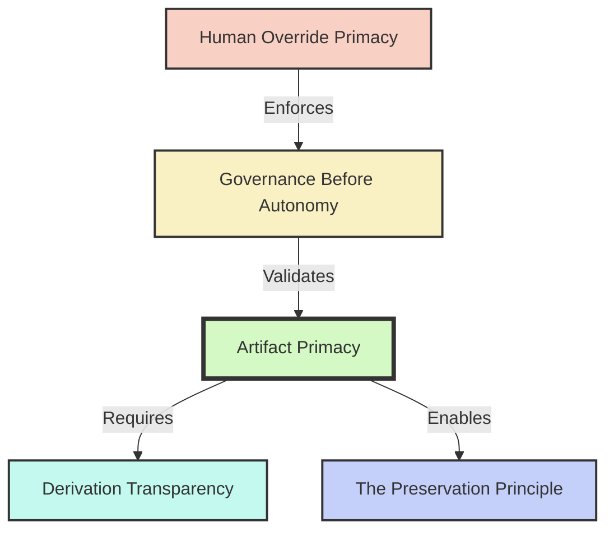

# Y-OS Constitutional Core v1

**Status:** ACTIVE
**Date:** 2026-06-13
**Authority:** Highest Layer of Y-OS Doctrine

---

## Preamble
The Constitutional Core defines the immutable identity of Y-OS. It sits above all architecture, governance, orchestration, and implementation. If every line of code, every AI model, and every runtime engine is replaced, the system remains Y-OS if and only if it strictly adheres to these five Articles.

---

## Article I: Artifact Primacy
**Artifacts are the sole source of organizational truth.**
The organization's memory, state, decisions, and context exist exclusively in explicit artifacts. Transient conversation history, implicit model memory, and unrecorded agent reasoning are legally non-existent. No action may be taken based on unrecorded state.

## Article II: The Preservation Principle
**Understanding once achieved shall not be lost.**
The organization must compound knowledge over time. When a worker discovers a new architectural truth, workflow, or constraint, it must be crystallized into an artifact. The organization must never solve the same structural problem twice from zero.

## Article III: Derivation Transparency
**Every state change must preserve lineage.**
No artifact may exist without a verifiable origin. The derivation chain (Parent Artifact → Context → Worker → Output Artifact) must be permanently observable. The organization must always be able to explain exactly *why* a specific decision was made.

## Article IV: Human Override Primacy
**Human authority supersedes all autonomous execution.**
The human architect retains absolute authority to halt execution, override governance verdicts, manually edit artifacts, and rewrite constitutional law. The system must never trap the human out of the decision loop.

## Article V: Governance Before Autonomy
**Autonomy cannot exist without governance.**
The organization is prohibited from executing unbounded loops without observability and validation. Every transition from intent to execution must pass through a governance boundary. Speed of execution must never be prioritized over safety of execution.

---

## Constitutional Dependency Graph

---

## The Replacement Test

To verify if a future system is still Y-OS, apply the Replacement Test:

1. Replace all AI models (e.g., GPT-5 -> GPT-7).
2. Replace all providers (e.g., OpenAI -> Local LLMs).
3. Replace all runtimes (e.g., Python scripts -> Rust binaries).
4. Replace all orchestration (e.g., Y-ORC -> Swarm Engine).
5. Replace all storage (e.g., Notion -> Postgres).

**Does the new system still operate exclusively through explicit artifacts, preserve lineage, compound knowledge, enforce governance boundaries, and obey human override?**

If YES -> The system is Y-OS.
If NO -> The system is a different entity.

---

## Semantic Links

*Inferred by KGC v2 — MISSION-015*

- **constrained_by:** [[Preservation_Principle]]
- **constrained_by:** [[Derivation_Transparency]]
- **constrained_by:** [[Artifact_Primacy]]
- **constrained_by:** [[Human_Override]]
- **constrained_by:** [[Governance_Before_Autonomy]]
