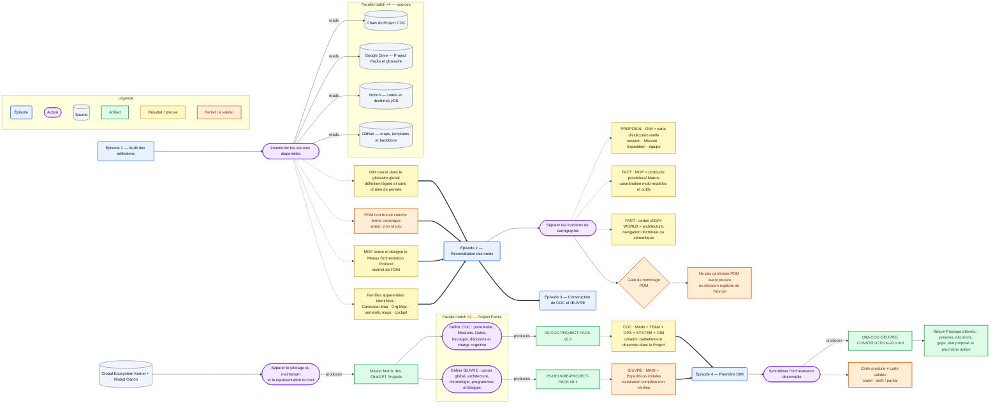

# OIM — Construction de COC et ŒUVRE v0.1

## État

- **FACT** — `Operational Intelligence Map` est déjà défini dans le glossaire global comme une visualisation légère de l’orchestration d’une session, sans chaîne de pensée privée ni traçage transactionnel exhaustif.
- **FACT** — `MOP` désigne le **Manus Orchestration Protocol**, un protocole procédural d’orchestration multi-modèles et multi-outils.
- **FACT** — les cartes yOS et Y-WORLD existantes servent surtout la navigation doctrinale, l’architecture organisationnelle ou la cartographie sémantique.
- **UNKNOWN** — aucune définition canonique vérifiable de `POM` n’a été trouvée dans les sources auditées.
- **PROPOSAL** — réserver `OIM` à la carte de l’exécution réelle et maintenir `POM` en statut non résolu jusqu’à découverte d’une source ou décision explicite.
- **STATUS** — cette première carte est produite, stockée dans le buffer Git, mais non revue et non canonisée.

## 1. Périmètre de l’audit

### Sources consultées

| Source | Élément | Fonction observée | Statut |
|---|---|---|---|
| ChatGPT Project COC | MAIN, TEAM, OPS, SYSTEM, OIM | Contexte opérationnel actif et initialisation des salles | Partiel : contexte visible, pas archive exhaustive |
| Google Drive | `05-Y-GLOBAL-CANON-AND-GLOSSARY.md` v0.2 | Définit COC, MissionOS et Operational Intelligence Map | Lu |
| Google Drive | `00-COC-PROJECT-PACK.md` v0.2 | Périmètre, hiérarchie, panneaux et règles COC | Lu |
| Google Drive | `05-OEUVRE-PROJECT-PACK.md` v0.1 | Périmètre, propriété du canon global, programmes et Bridges | Lu |
| Google Drive | `CHATGPT-PROJECTS-MASTER-MATRIX-v0.2.md` | Matrice d’installation et séparation des Projects | Extrait lu |
| Google Drive | `11-YOS-SYSTEM-MAP.md` v0.1 | Carte synthétique du système yOS et de sa mémoire | Extrait lu |
| Notion | `Y-OS Canonical Map v1` | Navigation doctrinale de Constitution à Exécution | Lu |
| Notion | `Y-OS Org Map v2` | Architecture organisationnelle canonique de yOS v1 | Lu |
| Notion | `25 MOP — Manus Orchestration Protocol` | Workflow procédural Manus, GPT, Claude, outils et Gates | Lu ; statut source : Draft |
| GitHub | `yos-vault/knowledge/Y-WORLD/04_Templates/Template - Map Node.md` | Template de nœud pour cartes sémantiques Y-WORLD | Lu |
| GitHub | `yos-vault/knowledge/Y-WORLD/02_Maps/*` | Famille de cartes sémantiques et spatiales | Index observé |
| Skill runtime | `operational-intelligence-map` + visual grammar | Grammaire de production des OIM | Utilisé comme implémentation, pas comme canon métier |

### Couverture

- Familles de sources interrogées : **4/4** — Project context, Drive, Notion, GitHub.
- Project Packs principaux COC/ŒUVRE : **2/2 lus**.
- Définition OIM exacte : **1 trouvée**.
- Définition POM exacte : **0 trouvée**.
- Journaux complets de construction COC/ŒUVRE : **non disponibles**.
- Installation complète du Project ŒUVRE : **non vérifiée**.

## 2. Réconciliation des noms

| Nom | Définition conservée | Ce que ce nom ne doit pas désigner | Statut |
|---|---|---|---|
| **OIM — Operational Intelligence Map** | Carte légère de l’orchestration réellement observable d’une session, Mission, Expedition ou équipe | Chaîne de pensée, log exhaustif, carte ontologique globale | Canon existant + modèle minimal proposé |
| **MOP — Manus Orchestration Protocol** | Protocole procédural permettant à Manus de coordonner modèles, outils, Gates, build et archivage | Carte visuelle d’une exécution | Source existante, Draft |
| **Y-OS Canonical Map** | Couche de navigation des doctrines et niveaux architecturaux yOS | Trace d’une session particulière | Canon Notion, foundation frozen |
| **Y-OS Org Map** | Représentation canonique des rôles, couches, artefacts et chaîne de valeur yOS v1 | Carte d’exécution d’une Expedition | Canon Notion officiel |
| **Y-WORLD semantic maps** | Cartes spatiales/sémantiques de domaines et relations de connaissance | Audit opérationnel temporel | Famille Git/Obsidian existante |
| **COC** | Cockpit visible du portefeuille : NOW, NEXT, Missions, Gates, exceptions, décisions et charge cognitive | MissionOS lui-même, ŒUVRE, moteur détaillé d’exécution | Canon global |
| **ŒUVRE** | Corps complet ; `05 · ŒUVRE` maintient architecture globale, canon, chronologie, programmes et Bridges | Cockpit opérationnel du maintenant | Canon global |
| **POM** | Non résolu | Toute définition inventée ou rétroactive | Gate ouverte |

### Gate de nommage — POM

**Décision proposée :** ne pas utiliser `POM` dans un Artifact canonique avant l’une des conditions suivantes :

1. une source versionnée existante est découverte ;
2. un ancien nom est explicitement relié à OIM, MOP ou une autre carte ;
3. Yannick prend une décision de création ou de supersession.

## 3. Modèle canonique minimal proposé pour OIM

### Ontologie

```text
Mission
  → Expeditions
    → Episodes opérationnels
      → Operations
        → Agents / Models
          → Tools / Connectors
            → Sources
              → Artifacts
                → Gates
                  → Return Package
```

### Contrat minimal

```yaml
oim:
  id: string
  title: string
  scope_type: session | mission | expedition | team
  scope_id: string
  generated_at: datetime
  status: draft | reviewed | accepted | integrated | canonized
  evidence_status: observed | reported | inferred | unknown
  time_window:
    start: datetime | unknown
    end: datetime | unknown
  objective: string
  episodes:
    - id: string
      title: string
      status: completed | partial | running | failed | interrupted | opaque | not_verified
      operations:
        - action: string
          actor: agent_or_model | unknown
          interface: tool_or_connector | none | unknown
          inputs: [source_id]
          outputs: [artifact_id]
          dependencies: [operation_id]
          result: string
          evidence: observed | reported | inferred
  parallel_batches:
    - label: string
      branches: [operation_id]
      shared_contract: string
  gates:
    - id: string
      criterion: string
      decision: pass | fail | pending | not_verified
  coverage:
    discovered: number | unknown
    selected: number | unknown
    read: number | unknown
    processed: number | unknown
    produced: number | unknown
    stored: number | unknown
    failed: number | unknown
  metrics:
    duration: exact | estimated | unknown
    tokens: exact | reported | unknown
    cost: exact | reported | unknown
  failures:
    - type: error | retry | waste | opacity | missing_evidence
      description: string
  final_state: string
  artifacts: [artifact_record]
  return_package:
    evidence: [source_id]
    decisions: [decision_id]
    unresolved: [gap_id]
    bridges: [bridge_note_id]
    proposed_state: string
    guardian_status: pending | passed | failed
    next_action: string
```

### Invariants

1. Une OIM montre **ce qui a été fait**, pas le raisonnement privé utilisé pour le faire.
2. Toute opération importante porte un statut et un niveau de preuve.
3. Les micro-appels répétés sont agrégés en une opération significative.
4. Les branches réellement indépendantes sont représentées comme parallèles ; le parallélisme n’est jamais inventé.
5. Une sortie **produite** est distincte d’une sortie **revue**, **acceptée**, **intégrée** ou **canonisée**.
6. Les durées, coûts, tokens, modèles et comptes ne sont affichés que lorsqu’ils sont observés ou explicitement rapportés.
7. Toute OIM importante se termine par un Return Package ou pointe vers celui-ci.
8. L’Artifact durable doit être stocké hors chat ; GitHub reste la destination canonique privilégiée.

## 4. Operational Map — construction de COC et ŒUVRE



## 5. Episode Summary

### Épisode 1 — Audit des définitions

Les sources actives et durables ont été interrogées. L’OIM possède une définition canonique minimale dans le glossaire global. Les recherches `POM` ont surtout retourné du bruit lexical de type Pomodoro ou des cartes génériques, sans définition métier correspondante. MOP a été vérifié comme protocole distinct.

### Épisode 2 — Réconciliation

Les objets ont été séparés par fonction : carte opérationnelle temporelle, protocole d’orchestration, carte doctrinale, carte organisationnelle, carte sémantique et cockpit. Aucun renommage silencieux n’est effectué.

### Épisode 3 — Construction de COC et ŒUVRE

Les sources montrent une séparation structurante : COC répond à ce qui doit se passer maintenant ; ŒUVRE répond à ce qu’est l’ensemble, à ses relations, à son évolution et à son canon. Cette séparation est matérialisée par une matrice globale et deux Project Packs. La création des salles COC est partiellement observable dans le Project actuel ; l’installation complète de ŒUVRE n’est pas vérifiée.

### Épisode 4 — Première OIM

Le présent Artifact combine l’audit, la réconciliation, le contrat minimal, la carte Mermaid et le ledger. Il est stocké dans le buffer Git `new-to-be-merged` et attend une revue Guardian avant intégration ou canonisation.

## 6. Execution Results Ledger

| Opération | Interface | Résultat | Statut | Preuve |
|---|---|---|---|---|
| Charger le skill OIM et sa grammaire visuelle | ChatGPT skill runtime | Structure de sortie et conventions visuelles disponibles | Completed | Observed |
| Rechercher OIM/POM dans les fichiers du Project | File search | Aucun fichier uploadé correspondant | Completed | Observed |
| Rechercher OIM, POM et cartes apparentées | Notion | OIM indirect, MOP exact, Canonical Map et Org Map identifiés | Partial | Observed |
| Rechercher OIM/POM et maps | GitHub | Templates et cartes sémantiques identifiés ; pas de POM canonique | Partial | Observed |
| Rechercher et lire les Project Packs | Google Drive | Packs COC et ŒUVRE, glossaire et matrice récupérés | Completed | Observed |
| Réconcilier les noms | Synthesis | OIM séparé de MOP et des cartes architecturales | Completed | Evidence-backed synthesis |
| Produire la carte interactive Mermaid | Mermaid Chart | Diagramme rendu | Completed | Observed |
| Créer le buffer Git | GitHub | Branche `new-to-be-merged` créée | Completed | Observed |
| Stocker l’Artifact OIM | GitHub | Fichier versionné créé | Completed | Observed |
| Valider le modèle et le nom POM | Guardian / Yannick | Non exécuté | Pending | Not verified |

## 7. Artifact Registry

| Artifact | Type | Localisation | État |
|---|---|---|---|
| `00-COC-PROJECT-PACK.md` v0.2 | Project Pack | Google Drive | Installation-ready |
| `05-OEUVRE-PROJECT-PACK.md` v0.1 | Project Pack | Google Drive | Source active |
| `05-Y-GLOBAL-CANON-AND-GLOSSARY.md` v0.2 | Global glossary | Google Drive | Canonical context |
| `Y-OS Canonical Map v1` | Doctrine navigation map | Notion | Foundation frozen |
| `Y-OS Org Map v2` | Organizational architecture map | Notion | Official |
| `25 MOP — Manus Orchestration Protocol` v0.1 | Procedural memory | Notion | Draft |
| `Template - Map Node.md` | Semantic map template | GitHub | Active template |
| `OIM-COC-OEUVRE-CONSTRUCTION-v0.1.md` | OIM | GitHub branch `new-to-be-merged` | Produced, not reviewed |

## 8. Efficiency Review

### Travail utile

- Lecture ciblée des sources de plus haute autorité avant synthèse.
- Séparation explicite entre canon global, doctrine yOS, mémoire procédurale et contexte de chat.
- Agrégation des recherches en épisodes opérationnels plutôt qu’en journal d’appels.
- Stockage Git immédiat de l’Artifact final hors du chat.

### Pertes de temps visibles

- La recherche lexicale `POM` dans Notion a principalement retourné des éléments Pomodoro.
- Les recherches sémantiques GitHub sur des expressions larges ont sur-apparié les nombreuses cartes Y-WORLD génériques.
- L’absence d’un registre de noms de cartes dédié oblige à croiser glossaire, Project Packs, Notion et GitHub.

### Améliorations proposées

1. Ajouter un **Map Type Registry** versionné avec nom, acronyme, fonction, propriétaire, couche, format, statut et supersessions.
2. Ajouter un schéma machine-readable `oim.schema.json` après validation du modèle minimal.
3. Générer automatiquement l’OIM à partir des Return Packages, tool receipts et manifests plutôt qu’à partir du chat seul.
4. Distinguer dans le futur dashboard : `observed`, `reported`, `inferred`, `not verified`.
5. Conserver Mermaid comme source texte canonique ; produire Excalidraw, SVG et Miro comme projections.

## 9. Unknowns and Verification Gaps

- Signification historique éventuelle de `POM`.
- Existence d’anciennes définitions OIM ou POM dans des chats Manus/Claude non connectés à l’audit.
- Séquence exacte, acteurs et temps de construction des Project Packs COC et ŒUVRE.
- État réel d’installation de `05 · ŒUVRE` dans ChatGPT.
- Revue Guardian du modèle minimal OIM.
- Destination canonique finale dans l’arborescence Git après KAP/KRE.
- Coûts, tokens et durée totale : non instrumentés, donc non déclarés.

## 10. Return Package

### Artifacts produits

- Carte interactive Mermaid.
- Artifact Markdown versionné : `new-to-be-merged/OIM/OIM-COC-OEUVRE-CONSTRUCTION-v0.1.md`.

### Décisions

- **PROPOSAL** — OIM demeure le nom de la carte d’orchestration observable.
- **PROPOSAL** — POM reste non résolu et ne doit pas être canonisé.
- **PROPOSAL** — Mermaid est la source textuelle de référence ; Excalidraw/Miro/SVG sont des vues dérivées.

### État proposé

`produced → awaiting Guardian review`

### Guardian status

`PENDING`

### Bridge

Une Bridge Note vers `05 · ŒUVRE` sera nécessaire si la taxonomie OIM/POM ou le Map Type Registry modifie le glossaire global ou l’architecture des cartes.

### Prochaine action unique

**Faire relire ce v0.1 par Guardian, résoudre ou maintenir ouvert le Gate POM, puis intégrer le modèle validé dans un Map Type Registry canonique.**
