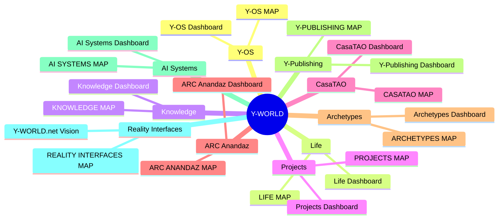

# Y-WORLD ROOT MAP

## 📋 Summary
*A concise, one-sentence strategic synthesis of this knowledge card.*

## 🧠 Key Ideas
* **Core Concept**: 
* **Insight 1**: 
* **Insight 2**: 

## ⚙️ Automation Relevance
* **Relevance**: {{value:automation_relevance}}
* **Decision Rules**: 
* **Routing Metadata**: 

## 🔄 Related Nodes
* [[HOME]]
* [[KNOWLEDGE MAP]]

# Y-WORLD ROOT MAP

This is the spatial semantic mindmap of Y-WORLD. It maps out the 10 core subsystems.

## Navigation

| Région | Map | Dashboard |
| :--- | :--- | :--- |
| Y-OS | [[Y-OS MAP]] | [[Y-OS Dashboard]] |
| Life | [[LIFE MAP]] | [[Life Dashboard]] |
| Knowledge | [[KNOWLEDGE MAP]] | [[Knowledge Dashboard]] |
| Projects | [[PROJECTS MAP]] | [[Projects Dashboard]] |
| CasaTAO | [[CASATAO MAP]] | [[CasaTAO Dashboard]] |
| ARC Anandaz | [[ARC ANANDAZ MAP]] | [[ARC Anandaz Dashboard]] |
| Archetypes | [[ARCHETYPES MAP]] | [[Archetypes Dashboard]] |
| Y-Publishing | [[Y-PUBLISHING MAP]] | [[Y-Publishing Dashboard]] |
| AI Systems | [[AI SYSTEMS MAP]] | [[AI Systems Dashboard]] |
| Reality Interfaces | [[REALITY INTERFACES MAP]] | [[Y-WORLD.net Vision]] |
