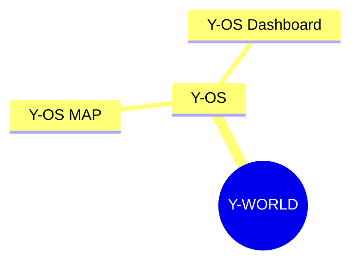

# Obsidian — Mermaid + Wikilinks incompatibility

## Leçon

**Ne jamais mettre de `[[wikilinks]]` à l'intérieur d'un bloc Mermaid dans Obsidian.**

Obsidian parse les `[[liens]]` **avant** que Mermaid ne lise le bloc de code. Résultat : Mermaid reçoit un fragment de texte cassé et génère une erreur de parsing.

## Erreur typique

```
Error parsing Mermaid diagram!
Parse error on line 4:
...OS      [[Y-OS MAP]]      [[Y-OS Dashb
---------------------^
Expecting 'SPACELINE', 'NL', 'EOF', got 'NODE_ID'
```

## Règle

| ❌ À éviter | ✅ À faire |
| :--- | :--- |
| Nœud Mermaid avec `[[lien]]` | Texte brut dans le nœud Mermaid |
| `Y-OS [[Y-OS MAP]]` | `Y-OS MAP` (texte seul) |

## Pattern correct

Séparer le diagramme Mermaid (visuel pur) des liens de navigation (tableau Markdown en dessous) :

````markdown


## Navigation
| Région | Map | Dashboard |
| :--- | :--- | :--- |
| Y-OS | [[Y-OS MAP]] | [[Y-OS Dashboard]] |
````

## Contexte

Découvert lors du déploiement du vault Y-WORLD (2026-05-29).
Fichier affecté : `02_Maps/Y-WORLD ROOT MAP.md`
Corrigé par Manus — suppression des wikilinks dans les nœuds + ajout d'un tableau de navigation séparé.
